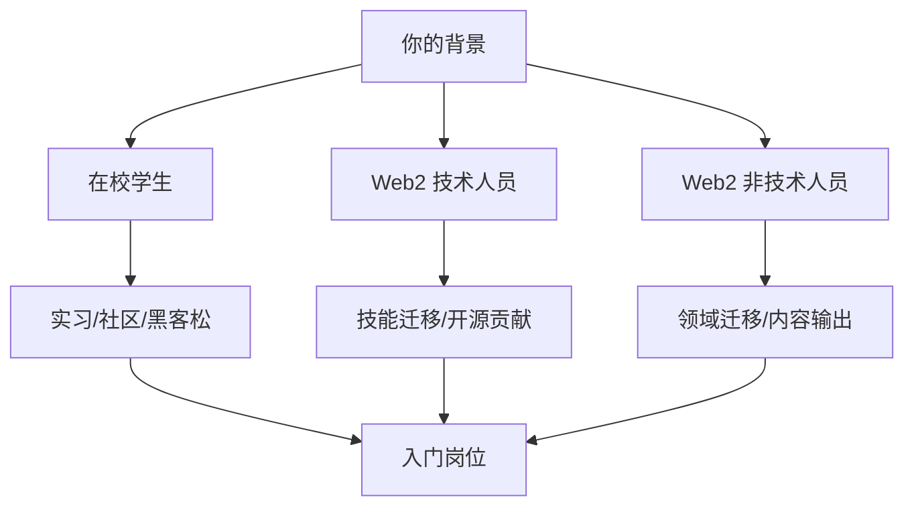

# 10.2 如果继续，最推荐的路径选择

> **学习目标**：完成本节后，你将能够：
> - 根据自己的背景（学生/Web2技术/Web2非技术）选择最适合的入场路径
> - 制定具体可执行的第一步行动计划
> - 了解不同起点的优劣势，做出理性选择

---

## 核心内容

### 1. 选择路径的核心原则

如果你在 10.1 中决定继续投入 Web3，接下来最重要的问题是：**从哪里开始？**

选择路径的三个核心原则：

1. **从优势出发**：利用你已有的技能和经验
2. **从小处着手**：先小规模尝试，验证后再加大投入
3. **可执行优先**：选择今天就能开始的事，而非"等准备好了再说"

> **Tips**：没有"最好"的路径，只有"最适合你"的路径。

### 2. 不同背景的推荐路径

根据 [BlockBeats 2025 调研](https://www.theblockbeats.info/news/58880)，不同背景的人有不同的最佳起点：

#### 2.1 在校学生路径

**优势**：时间充裕、学习成本低、试错空间大

**推荐路线**：

| 阶段 | 行动 | 产出 |
|-----|------|------|
| 第 1-2 月 | 加入校园区块链社团/线上社区 | 建立初步人脉 |
| 第 2-4 月 | 参加 1-2 次黑客松（Hackathon） | 项目经验 + 作品 |
| 第 4-6 月 | 申请 Web3 公司实习 | 真实工作经验 |
| 持续 | 运营 Twitter/公众号 | 个人品牌 |

**推荐起点**：
- **技术方向**：CryptoZombies → 参加黑客松 → GitHub 开源贡献
- **非技术方向**：社区运营志愿者 → 内容翻译/创作 → BD/运营实习

**具体资源**：
- 黑客松平台：[ETHGlobal](https://ethglobal.com/)、[Devfolio](https://devfolio.co/)
- 求职平台：[CryptoJobsList](https://cryptojobslist.com/)、[Web3.career](https://web3.career/)

#### 2.2 Web2 技术人员路径

**优势**：已有编程基础、理解软件开发流程

**推荐路线**：

| 阶段 | 行动 | 产出 |
|-----|------|------|
| 第 1 月 | 学习 Solidity 基础（CryptoZombies） | 基础技能 |
| 第 2-3 月 | 完成 1-2 个个人项目 | GitHub 作品集 |
| 第 3-4 月 | 参与开源项目（小 PR 开始） | 贡献记录 |
| 第 4-6 月 | 申请远程/全职岗位 | 工作机会 |

**技能迁移对照**：

| Web2 技能 | Web3 对应 | 学习重点 |
|----------|----------|---------|
| 前端（React/Vue） | DApp 前端 | web3.js/ethers.js |
| 后端（Java/Go） | 智能合约/节点 | Solidity/Rust |
| 全栈 | 全栈 DApp | 前端 + 合约 |
| DevOps | 链节点运维 | 区块链基础设施 |
| 安全 | 智能合约审计 | 合约漏洞模式 |

**薪资参考**（来源：[Cointelegraph 2025](https://cointelegraph.com/news/highest-paying-jobs-in-crypto-2025)）：
- 智能合约开发：$100k-$250k+/年
- 前端开发：$80k-$180k/年
- 安全审计：$120k-$300k/年

#### 2.3 Web2 非技术人员路径

**优势**：已有专业领域经验、理解商业逻辑

**推荐路线**：

| 阶段 | 行动 | 产出 |
|-----|------|------|
| 第 1-2 月 | 从熟悉领域切入，关注对应 Web3 赛道 | 行业认知 |
| 第 2-4 月 | 活跃于 Twitter/Discord，输出内容 | 个人影响力 |
| 第 4-6 月 | 申请对口岗位或参与 DAO | 实战经验 |

**领域迁移对照**：

| Web2 角色 | Web3 对应 | 切入点 |
|----------|----------|--------|
| 产品经理 | Web3 PM | 理解 Token 经济模型 |
| 运营 | 社区运营 | 管理 Discord/TG |
| 市场 | 加密市场/Growth | 了解空投、KOL 合作 |
| BD | Web3 BD | 理解 B2B 合作模式 |
| 内容 | 内容/研究 | 输出研报、教程 |
| 金融 | DeFi 分析 | 理解协议和收益 |

### 3. 起点选择：交易平台 vs 项目方

根据调研，75% 的求职者首选交易平台，56% 选择项目方。两者各有优劣：

| 维度 | 中心化交易平台（CEX） | 项目方/初创 |
|-----|---------------------|------------|
| **稳定性** | 高 | 低 |
| **培训体系** | 完善 | 几乎没有 |
| **学习速度** | 中等 | 很快 |
| **贴近一线** | 较远 | 非常近 |
| **品牌背书** | 强 | 弱 |
| **适合人群** | 求稳、转型初期 | 愿意冒险、快速成长 |

**选择建议**：
- **第一份 Web3 工作求稳**：选交易平台（Binance、OKX、Coinbase 等）
- **愿意承担风险换成长**：选有融资背景的项目方
- **不确定**：先加入交易平台，积累经验后再跳槽

### 4. 时间投入策略

根据你能投入的时间，选择不同策略：

| 时间投入 | 策略 | 预期产出 |
|---------|------|---------|
| **<5 小时/周** | 纯学习观察 | 保持认知更新 |
| **5-15 小时/周** | 兼职参与 | 小额收益 + 经验积累 |
| **15-30 小时/周** | 认真副业 | 可观收益 + 作品集 |
| **全职** | All in | 职业转型 |

> **Tips**：不建议一开始就全职投入。先用 3-6 个月兼职参与，验证自己的判断后再决定是否 all in。

### 5. 立即可执行的第一步

无论你是什么背景，以下行动**今天就可以开始**：

#### 通用行动（所有人）
- [ ] 注册 Twitter/X 账号，关注 50+ Web3 项目和 KOL
- [ ] 加入 3-5 个活跃的 Discord 社区
- [ ] 创建或激活你的加密钱包（如 MetaMask）
- [ ] 在 [CryptoJobsList](https://cryptojobslist.com/) 浏览当前岗位需求

#### 技术方向专属
- [ ] 完成 [CryptoZombies](https://cryptozombies.io/) 前 3 课（约 2-3 小时）
- [ ] 在 GitHub 创建 Web3 学习仓库
- [ ] 浏览 [Ethereum.org 开发者文档](https://ethereum.org/developers)

#### 非技术方向专属
- [ ] 发布第一条 Web3 学习笔记（Twitter 或公众号）
- [ ] 翻译或整理一篇英文资讯
- [ ] 在一个 DAO 的治理论坛留言或投票

---

## 案例/故事

**小王：从后端工程师到 Web3 开发者**

小王是一名 30 岁的 Java 后端工程师，在传统互联网公司工作了 5 年。2024 年初，他决定转型 Web3。

**他的路径**：
1. **第 1 个月**：利用周末学习 Solidity，完成 CryptoZombies 全部课程
2. **第 2-3 个月**：用 Solidity 重写了一个简单的投票 DApp，部署到测试网
3. **第 3 个月**：在 GitHub 上给一个开源项目提了 3 个小 PR（修 bug + 改文档）
4. **第 4 个月**：开始在 Twitter 分享学习笔记，积累了 500 粉丝
5. **第 5 个月**：通过 Discord 认识的人内推，拿到一家 DeFi 项目的远程 offer

**他的经验总结**：
- 技术迁移比想象中容易，核心编程思维是通用的
- 公开输出（GitHub + Twitter）是最有效的求职方式
- 社区人脉比投简历更重要

**薪资变化**：从税前 40 万/年 → 远程 $120k/年（约 85 万人民币），还有 Token 激励。

---

## 关键概念速查

| 概念 | 一句话解释 |
|-----|-----------|
| 技能迁移 | 将已有技能应用到新领域，减少从零开始的成本 |
| 黑客松 | Hackathon，短期内组队完成项目的竞赛活动 |
| 开源贡献 | 为公开的代码项目贡献代码或文档 |
| DAO | 去中心化自治组织，通过 Token 进行治理 |
| 个人品牌 | 在行业内建立的声誉和影响力 |
| 远程工作 | 不在办公室、通过网络完成的工作模式 |

---

## 学习资料

### 必读
- [How to Get a Web3 Job in 2025](https://web3.career/learn-web3/how-to-get-web3-job-2025) - 完整求职指南（预计阅读 15 分钟）
- [CryptoJobsList](https://cryptojobslist.com/) - 浏览当前岗位，了解市场需求

### 选读（进阶）
- [The Ultimate Guide to Building a Web3 Career](https://cryptonomads.org/research/crypto-events/the-ultimate-guide-to-building-a-web3-career-in-2025) - 深度职业规划
- [大厂转行Web3指南](https://www.woshipm.com/zhichang/5779785.html) - 中文版转型经验
- [CryptoZombies](https://cryptozombies.io/) - 免费 Solidity 入门教程（技术方向必做）

---

## 学习任务

完成以下任务以检验学习效果：

- [ ] **任务 1**：根据你的背景，从本文选择一条推荐路径，并列出接下来 3 个月的行动计划（每月 2-3 项具体行动）
- [ ] **任务 2**：完成"立即可执行的第一步"中的至少 3 项，并记录完成情况
- [ ] **任务 3**：在 [CryptoJobsList](https://cryptojobslist.com/) 或 [Web3.career](https://web3.career/) 找到 3 个你感兴趣的岗位，记录其职位要求

> **提交方式**：将任务输出记录在个人学习笔记中

---

## 常见问题 FAQ

**Q1: 我没有任何技术背景，是不是很难进入 Web3？**

A: 不是。根据行业数据，非技术岗位占比约 35% 且快速增长。社区运营、内容创作、BD、市场等岗位都不需要编程技能。关键是找到你已有技能与 Web3 的结合点。

**Q2: 应该先学技术还是先找工作？**

A: 取决于你的目标。如果想做开发，先学 3 个月基础再找工作；如果想做非技术岗，可以边学边找，因为"了解行业"比"精通技术"更重要。

**Q3: 国内还是海外机会更多？**

A: 海外机会更多，但国内也有。建议：1）优先考虑远程岗位，不限地域；2）提升英语能力是长期投资；3）国内可以从交易平台（OKX、Bybit 等在国内有团队）或华人项目方开始。

**Q4: 需要辞职全职学习吗？**

A: 强烈不建议。Web3 入门不需要全职投入，每周 10-15 小时足够。先兼职参与 3-6 个月，有了 offer 或稳定收入来源后再考虑辞职。

**Q5: 没有"内推"怎么办？**

A: Web3 的"内推"主要来自社区参与。加入 Discord、参加线下活动、在 Twitter 输出内容，3 个月内就能建立初步人脉。很多岗位是通过社区关系而非正式投简历获得的。

---

## 下一步

- 按照本节的路径开始行动，3 个月后评估进展
- 如果中途发现不适合，阅读 [10.3 如果不继续，如何止损与抽身](10.3-如果不继续如何止损与抽身.md)
- 如果需要更系统的学习，阅读 [10.4 是否进入下一阶段](10.4-是否进入下一阶段.md)

---

最后更新：2025-01-09
编写：AI Assistant
审核：待审核
