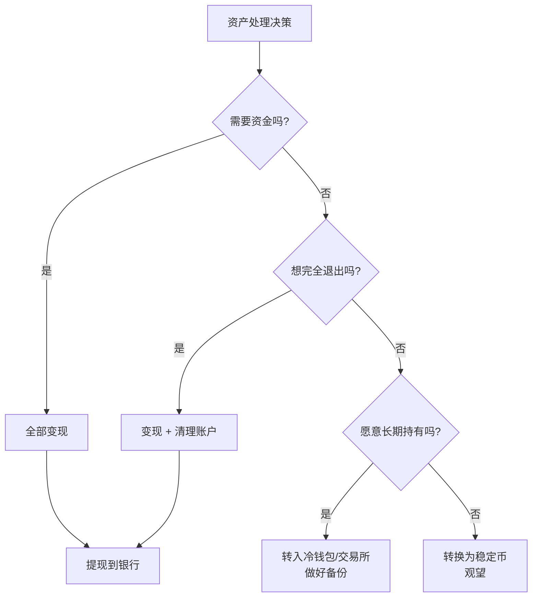

# 10.3 如果不继续，如何止损与抽身

> **学习目标**：完成本节后，你将能够：
> - 理解"不继续是理性选择"，消除不必要的焦虑
> - 安全、有序地处理链上资产和账户
> - 调整心态，避免 FOMO 和后悔情绪

---

## 核心内容

### 1. 退出是理性选择

首先，请明确一点：**决定不继续投入 Web3 是完全合理的决策。**

这不是失败，不是"错过"，而是基于你自身情况做出的理性选择。

**为什么退出可能是更好的选择**：
- Web3 不适合所有人——这是事实，不是安慰
- 你的时间和精力在其他领域可能创造更大价值
- 行业波动性大，保守策略本身就是明智选择
- 你在本课程学到的知识不会白费

> **Tips**：最糟糕的状态是"半进半出"——既焦虑又不行动。做出明确决定，无论是继续还是退出，都比犹豫不决好。

### 2. 资产处理指南

如果你有链上或交易所资产，需要妥善处理。

#### 2.1 资产盘点

首先，盘点你所有的加密资产：

| 位置 | 检查项 |
|-----|--------|
| **交易所** | 各交易所账户余额（Binance、OKX 等） |
| **热钱包** | MetaMask、OKX Wallet 等钱包余额 |
| **冷钱包** | 硬件钱包（如有） |
| **DeFi 协议** | Staking、借贷、LP 等未提取资产 |
| **NFT** | 持有的 NFT 资产 |

#### 2.2 处理方案选择

根据你的情况选择合适的方案：

**各方案详解**：

| 方案 | 适用场景 | 操作步骤 |
|-----|---------|---------|
| **全部变现** | 需要资金或完全退出 | 卖出 → 提现到银行 |
| **部分持有** | 想保留小额长期观望 | 保留 BTC/ETH → 转冷钱包 |
| **转稳定币** | 不想承担波动但想保留可能性 | 转 USDC/USDT → 放交易所 |
| **托管存放** | 不想管理但想保留 | 转入合规交易所（Coinbase 等） |

#### 2.3 变现步骤

如果决定变现：

1. **从 DeFi 协议提取资产**
   - 解除 Staking
   - 撤回 LP（注意无常损失）
   - 还清借贷

2. **归集到交易所**
   - 小币种优先在 DEX 换成主流币
   - 主流币转入交易所

3. **卖出变现**
   - 分批卖出，避免滑点
   - 选择流动性好的交易对（如 BTC/USDT）
   - 记录交易价格（用于税务）

4. **提现到银行**
   - 确认交易所支持法币提现
   - 注意单笔/单日限额
   - 保留提现记录

> **Tips**：如果金额较大，建议分多次提现，避免银行账户被风控。

### 3. 账户安全清理

即使决定退出，也必须完成以下安全操作，避免未来被盗或损失。

#### 3.1 撤销 Token 授权（重要！）

你在使用 DApp 时，可能授权了它们使用你的 Token。这些授权**不会自动失效**，可能被恶意利用。

**操作步骤**：

1. 访问 [Revoke.cash](https://revoke.cash/)
2. 连接你的钱包
3. 查看所有授权
4. 逐一撤销（需要支付少量 Gas）

**重点检查**：
- Uniswap、SushiSwap 等 DEX
- OpenSea 等 NFT 平台
- 不认识的合约地址

> **Tips**：撤销授权需要 Gas 费。如果钱包里没有 ETH，需要先转入少量用于支付 Gas。

#### 3.2 私钥/助记词备份

即使不再使用，也要安全保存私钥和助记词：

| 做 | 不做 |
|---|------|
| 写在纸上，存放安全位置 | 存在手机备忘录 |
| 使用密码管理器（如 1Password） | 截图保存 |
| 考虑分散存储（如两个地点） | 发给自己的邮箱 |
| 标注钱包地址对应关系 | 告诉他人 |

**为什么要保留**：
- 未来可能有空投到这个地址
- 可能有忘记的小额资产
- 作为 Web3 经历的记录

#### 3.3 交易所账户处理

| 操作 | 说明 |
|-----|------|
| **关闭 API** | 防止第三方应用继续访问 |
| **检查 2FA** | 确保开启或记录恢复码 |
| **更新安全设置** | 更改密码、检查绑定邮箱/手机 |
| **是否注销** | 如完全退出可考虑注销，但建议保留以备需要 |

#### 3.4 安全清理检查清单

- [ ] 已撤销所有 Token 授权（使用 Revoke.cash）
- [ ] 已安全备份所有助记词/私钥
- [ ] 已关闭交易所 API 权限
- [ ] 已更新交易所安全设置
- [ ] 已记录所有钱包地址和对应助记词位置

### 4. 心理调整

退出后最难的可能不是技术操作，而是**心理调整**。

#### 4.1 常见的负面情绪

| 情绪 | 表现 | 应对 |
|-----|------|------|
| **FOMO** | 担心错过暴涨行情 | 记住：你无法抓住所有机会 |
| **后悔** | 纠结"如果当初..." | 这是事后诸葛亮，不要回头看 |
| **焦虑** | 继续关注价格和新闻 | 取消关注，断开信息源 |
| **不甘** | 觉得付出没有回报 | 学到的知识是真实的收获 |

#### 4.2 减少 FOMO 的具体行动

1. **取消关注**
   - 取消关注大部分 Web3 Twitter 账号
   - 退出大部分 Discord/Telegram 群
   - 只保留 1-2 个用于偶尔了解

2. **删除 App**
   - 删除价格追踪 App（CoinGecko、CoinMarketCap）
   - 删除交易所 App（如果不需要）
   - 关闭浏览器书签

3. **设定复盘时间**
   - 在日历上设定 6 个月后的提醒
   - 到时候再评估是否重新关注
   - 在此之前，不主动关注

4. **转移注意力**
   - 把时间投入到其他有价值的事情
   - 发展其他兴趣或技能
   - 与非 Web3 圈的朋友交流

### 5. 保留什么，放弃什么

| 建议保留 | 建议放弃 |
|---------|---------|
| 助记词备份（物理介质） | 日常关注 Web3 动态 |
| 少量主流资产（可选） | 小币种和大部分 NFT |
| 核心学习笔记 | Discord/Telegram 群 |
| 1-2 个行业联系人 | 大部分 KOL 关注 |
| 区块链基础认知 | "暴富"心态 |
| 交易所账号（保留但不活跃） | 每日看盘习惯 |

---

## 案例/故事

**小张的理性退出**

小张是一名 35 岁的金融从业者，2022 年牛市末期进入 Web3，投入了 10 万人民币。

**他的经历**：
- 2022 年：投入 10 万，追高买入各种币
- 2023 年：亏损 60%，资产缩水到 4 万
- 2023 年底：花 3 个月系统学习 Web3
- 2024 年初：用评估框架分析自己

**他的评估结果**：
- 时间：2 分（工作繁忙，无法持续投入）
- 资金：3 分（亏损影响了家庭财务规划）
- 风险：2 分（无法再承受大额亏损）
- 总分：15 分，属于"谨慎考虑"区间

**他的决定**：
1. 保留 1 万的 BTC 作为长期持有
2. 其余全部变现，提现到银行
3. 撤销所有授权，备份好助记词
4. 取消关注所有 Web3 账号
5. 设定 1 年后复盘

**他的感受**：
> "做出退出决定后，反而轻松了。不用每天看价格，不用焦虑错过什么。剩下的 1 万 BTC 就当买了个'门票'，万一以后还想回来，门没有关死。"

**1 年后的复盘**：
- BTC 价格回升，他保留的 1 万变成了 2 万
- 但他发现自己并不后悔当初的决定
- 他把节省的时间用来考了 CFA，职业发展更好

---

## 关键概念速查

| 概念 | 一句话解释 |
|-----|-----------|
| Token 授权 | 允许智能合约使用你钱包中的 Token |
| Revoke.cash | 检查和撤销 Token 授权的工具 |
| 冷钱包 | 离线存储私钥的硬件设备，安全性最高 |
| FOMO | Fear of Missing Out，害怕错过的焦虑 |
| 止损 | 在损失扩大前主动退出，控制损失 |
| 机会成本 | 选择一个选项而放弃的其他选项的价值 |

---

## 学习资料

### 必读
- [Revoke.cash](https://revoke.cash/) - 授权管理工具，退出前必用（使用 5-10 分钟）
- [Crypto Exit Strategies](https://koinly.io/blog/crypto-exit-strategies/) - 退出策略详解（预计阅读 10 分钟）

### 选读（进阶）
- [Mastering Crypto Exit Strategies](https://coinbureau.com/guides/crypto-exit-strategies/) - CoinBureau 的深度退出指南
- [Etherscan Token Approval Checker](https://etherscan.io/tokenapprovalchecker) - 以太坊授权检查工具

---

## 学习任务

完成以下任务以检验学习效果：

- [ ] **任务 1**：使用 [Revoke.cash](https://revoke.cash/) 检查你钱包的授权情况，记录有多少个授权，并决定是否撤销
- [ ] **任务 2**：完成"安全清理检查清单"中的所有项目
- [ ] **任务 3**：写下你决定退出的原因，以及 6 个月后复盘时想回顾的 3 个问题

> **提交方式**：将任务输出记录在个人学习笔记中（私密保存）

---

## 常见问题 FAQ

**Q1: 我只有很少的资产（比如几百块），还需要这么麻烦吗？**

A: 资产处理可以简化，但**授权撤销**仍然建议做。即使钱包里只有几块钱，如果有恶意授权，未来你往里面转钱可能会被盗。

**Q2: 撤销授权需要 Gas 费，但我钱包里没有 ETH 了怎么办？**

A: 需要先转入少量 ETH 用于支付 Gas。如果金额太小不值得，可以选择放弃这个钱包（但仍需备份助记词，以防未来有空投）。

**Q3: 我应该把币换成稳定币还是直接卖掉？**

A: 取决于你的需求：
- 需要用钱 → 直接卖掉提现
- 可能会回来 → 换成 USDC/USDT，放交易所
- 完全退出 → 直接卖掉更省心

**Q4: 退出后还会有空投吗？**

A: 可能会。如果你曾经与某些协议交互过，未来可能收到空投。所以建议保留助记词，偶尔（比如每年一次）检查一下钱包。

**Q5: 如何判断是"理性退出"还是"在低点卖出"？**

A: 区分的关键：
- 理性退出：基于你的个人情况（时间、风险承受等）做出的决定
- 恐慌卖出：因为价格下跌而做出的情绪化决定

如果你是在价格下跌时做的决定，建议等价格稳定 1-2 周后再执行，确保不是情绪驱动。

---

## 下一步

- 完成本节的安全清理任务
- 如果想了解后续学习选项，阅读 [10.4 是否进入下一阶段](10.4-是否进入下一阶段.md)
- 设定 6 个月后的复盘提醒

---

最后更新：2025-01-09
编写：Antony
审核：待审核
