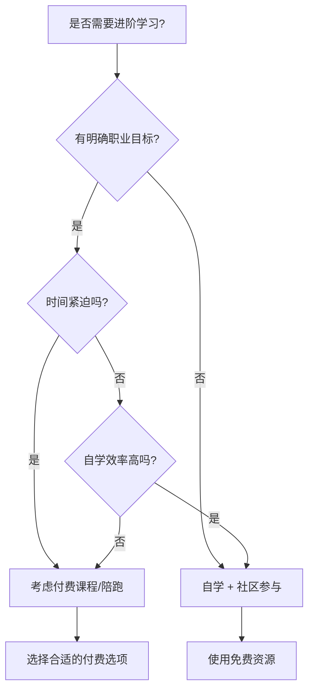
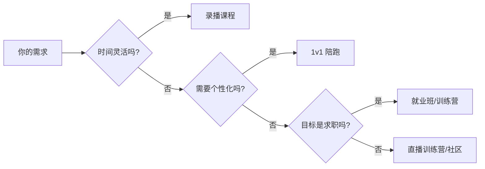

# 10.4 是否进入下一阶段陪跑/专项课程

> **学习目标**：完成本节后，你将能够：
> - 判断自己是否需要更深入的学习指导
> - 了解自学与付费学习的优劣势，做出理性选择
> - 识别优质课程和避开低质量课程

---

## 核心内容

### 1. 你已经走到了哪里

恭喜你完成了 Web3 通识课的学习！

此时，你应该已经：
- 建立了完整的 Web3 认知框架
- 理解了区块链、钱包、Token、DeFi 等核心概念
- 完成了基础的链上操作
- 对主流赛道和风险有了清晰认知
- 做出了"是否继续"的初步决定

接下来的问题是：**如果决定继续，需要更深入的学习吗？还是可以自学？**

### 2. 判断是否需要进阶学习

#### 2.1 可能需要进阶学习的信号

| 信号 | 说明 |
|-----|------|
| 知道方向但不知道下一步 | 完成基础学习，但缺乏具体路径 |
| 有明确的职业转型目标 | 想在 X 个月内找到 Web3 工作 |
| 自学效率低、缺乏反馈 | 学了很多但不知道学得对不对 |
| 需要项目实战经验 | 缺乏可展示的作品集 |
| 希望快速建立人脉 | 需要进入行业圈子 |
| 需要就业指导 | 不知道如何写简历、面试 |

#### 2.2 可能不需要进阶学习的信号

| 信号 | 说明 |
|-----|------|
| 只是业余兴趣 | 不打算深度参与或求职 |
| 自学能力很强 | 能自行规划路线并执行 |
| 已有相关经验 | 有编程或金融背景 |
| 时间/资金有限 | 免费资源足够满足需求 |
| 偏好自由探索 | 不喜欢结构化课程 |

#### 2.3 决策流程

### 3. 自学 vs 付费学习

#### 3.1 对比分析

| 维度 | 自学 | 付费课程/陪跑 |
|-----|------|--------------|
| **成本** | 低（仅时间） | 高（¥500-50000+） |
| **效率** | 因人而异 | 通常更高效 |
| **系统性** | 需自行构建 | 已设计好 |
| **反馈** | 无/社区 | 有导师反馈 |
| **人脉** | 需主动建立 | 自带同学圈 |
| **实战** | 需自找项目 | 课程内项目 |
| **就业帮助** | 自行求职 | 可能有内推 |
| **灵活性** | 高 | 低 |

#### 3.2 自学适合的人

- 自律性强，能坚持每周学习
- 有编程或相关专业基础
- 时间充裕，不急于求成
- 善于利用搜索引擎和社区
- 享受自由探索的过程

#### 3.3 付费学习适合的人

- 希望在明确时间内达成目标
- 需要系统化的知识体系
- 需要导师指导和即时反馈
- 希望获得就业帮助或内推
- 愿意用金钱换时间

### 4. 付费学习类型

如果决定付费学习，市面上有多种形式：

| 类型 | 特点 | 价格区间 | 适合人群 |
|-----|------|---------|---------|
| **录播课程** | 灵活、可反复观看 | ¥500-3,000 | 自学能力强、时间灵活 |
| **直播训练营** | 有互动、有作业、有进度 | ¥2,000-10,000 | 需要督促、喜欢互动 |
| **1v1 陪跑** | 完全个性化指导 | ¥5,000-30,000+ | 目标明确、预算充足 |
| **就业班** | 包含求职服务 | ¥10,000-50,000 | 以求职为目标 |
| **DAO/付费社区** | 持续学习 + 人脉 | ¥0-5,000/年 | 长期参与、重视人脉 |

#### 4.1 如何选择

### 5. 如何判断课程质量

付费课程质量参差不齐，需要谨慎判断。

#### 5.1 优质课程的信号

| 信号 | 说明 |
|-----|------|
| 讲师有真实行业经验 | 能找到讲师的公开作品、社交账号 |
| 有明确的项目产出 | 课程结束后你能拿出可展示的作品 |
| 提供试听或退款保证 | 对内容有信心才敢这样做 |
| 有真实学员评价 | 能联系到往期学员了解真实情况 |
| 内容持续更新 | Web3 变化快，课程需要跟上 |
| 价格合理 | 与市场平均水平相当 |

#### 5.2 警惕的信号

| 信号 | 说明 |
|-----|------|
| **承诺"包就业"** | 没有人能保证就业 |
| **承诺"保证赚钱"** | 这是投资欺诈的常见话术 |
| **讲师背景模糊** | 无法验证真实经历 |
| **过度包装** | "XX大厂"但无法证实 |
| **价格异常高** | 远超市场平均 |
| **没有课程大纲** | 不知道具体学什么 |
| **制造焦虑** | "现在不学就晚了" |
| **无法试听** | 对内容没有信心 |

#### 5.3 购买前的检查清单

- [ ] 能找到讲师的公开社交账号和作品吗？
- [ ] 有完整的课程大纲吗？
- [ ] 能试听或有退款保证吗？
- [ ] 能联系到往期学员吗？
- [ ] 价格在市场合理范围内吗？
- [ ] 课程最近更新过吗（3-6 个月内）？

### 6. 优质免费资源

在决定付费之前，建议先充分利用免费资源：

#### 6.1 技术方向

| 资源 | 说明 | 链接 |
|-----|------|------|
| **CryptoZombies** | Solidity 入门必做 | [cryptozombies.io](https://cryptozombies.io/) |
| **Ethereum.org 文档** | 官方开发者文档 | [ethereum.org/developers](https://ethereum.org/developers) |
| **Solidity by Example** | 实用代码示例 | [solidity-by-example.org](https://solidity-by-example.org/) |
| **Patrick Collins YouTube** | 免费视频教程 | YouTube 搜索 |
| **Alchemy University** | 免费 Web3 开发课程 | [university.alchemy.com](https://university.alchemy.com/) |

#### 6.2 非技术方向

| 资源 | 说明 | 链接 |
|-----|------|------|
| **Binance Academy** | 全面的入门教程（中英文） | [academy.binance.com](https://academy.binance.com/) |
| **a16z crypto** | 顶级投资机构的研报 | [a16zcrypto.com](https://a16zcrypto.com/) |
| **Bankless** | 深度内容（播客/文章） | [bankless.com](https://www.bankless.com/) |
| **MIT 区块链课程** | Gary Gensler 讲授 | YouTube 搜索 "MIT Blockchain" |

#### 6.3 实践平台

| 平台 | 用途 |
|-----|------|
| [Dune Analytics](https://dune.com/) | 数据分析练习 |
| [DefiLlama](https://defillama.com/) | DeFi 数据研究 |
| GitHub 开源项目 | 代码学习和贡献 |
| 各项目 Discord | 社区参与和学习 |

### 7. 关于本课程的后续服务

> **说明**：本节内容保持客观，不过度推销后续服务。

如果你对更深入的学习感兴趣，可以考虑：

**什么情况下可能需要陪跑服务**：
- 有明确的职业目标但不知道具体路径
- 需要 1v1 的个性化指导
- 希望有人帮助 review 你的学习成果
- 需要行业内的人脉引荐

**什么情况下不需要**：
- 只是业余兴趣
- 自学能力强，免费资源足够
- 预算有限
- 不确定是否要长期投入

> **建议**：即使考虑付费服务，也建议先自学 1-3 个月，验证自己的决心和学习能力后再决定。

---

## 案例/故事

**两个学员的不同选择**

**小陈的选择：自学**

小陈是一名前端工程师，决定转型 Web3 开发。他的选择：
1. 用 CryptoZombies 学习 Solidity 基础（2 周）
2. 跟着 YouTube 教程做了 2 个小项目（1 个月）
3. 在 GitHub 上给 Uniswap 的文档提了几个 PR（2 周）
4. 在 Twitter 上分享学习笔记，积累了 1000 粉丝（持续）
5. 通过 Discord 认识的人内推，拿到了 offer（第 4 个月）

**总花费**：0 元（只有时间成本）
**总时长**：4 个月
**适合他的原因**：自学能力强、有编程基础、时间充裕

---

**小林的选择：付费训练营**

小林是一名非技术背景的产品经理，想转型 Web3 PM。她的选择：
1. 参加了一个 2 个月的 Web3 产品训练营（¥8,000）
2. 训练营提供了系统的课程 + 实战项目 + 内推机会
3. 结识了 30+ 同期学员，建立了人脉
4. 通过训练营内推，拿到了一个初创项目的 PM offer（第 3 个月）

**总花费**：¥8,000
**总时长**：3 个月
**适合她的原因**：非技术背景需要系统学习、时间紧迫、需要人脉

---

**总结**：没有"更好"的选择，只有"更适合你"的选择。

---

## 关键概念速查

| 概念 | 一句话解释 |
|-----|-----------|
| 陪跑服务 | 1v1 或小班形式的持续指导服务 |
| 训练营 | 有固定周期和进度的集中学习项目 |
| 内推 | 通过熟人推荐获得面试或工作机会 |
| 自学 | 自主规划和执行学习计划 |
| 开源贡献 | 为公开的代码项目贡献代码或文档 |

---

## 学习资料

### 必读
- [CryptoZombies](https://cryptozombies.io/) - 免费 Solidity 入门，技术方向必做（预计 10-20 小时）
- [Binance Academy](https://academy.binance.com/) - 免费 Web3 入门，所有人适用（按需阅读）

### 选读（进阶）
- [登链社区](https://learnblockchain.cn/) - 中文技术社区，有付费和免费内容
- [Bankless](https://www.bankless.com/) - 英文深度内容，适合进阶
- [Alchemy University](https://university.alchemy.com/) - 免费 Web3 开发课程

---

## 学习任务

完成以下任务以检验学习效果：

- [ ] **任务 1**：根据本节的"决策流程"，判断你属于"需要进阶学习"还是"可以自学"，并写下理由
- [ ] **任务 2**：选择 1-2 个免费资源，完成其中的入门内容（如 CryptoZombies 前 3 课）
- [ ] **任务 3**：如果考虑付费课程，用"购买前检查清单"评估 1 个你感兴趣的课程

> **提交方式**：将任务输出记录在个人学习笔记中

---

## 常见问题 FAQ

**Q1: 付费课程真的比自学效率高吗？**

A: 取决于你的情况。如果你自学能力强、时间充裕、有相关背景，自学可能更合适。如果你需要系统指导、时间紧迫、背景较弱，付费课程可能更高效。没有绝对答案。

**Q2: 花几万块学 Web3 值得吗？**

A: 需要计算 ROI（投资回报率）。如果课程能帮你更快找到工作，薪资增加覆盖学费，那就值得。如果只是"学着玩"，可能不值得花这么多钱。

**Q3: 如何识别"割韭菜"的课程？**

A: 主要看是否有：1）承诺收益或包就业；2）讲师背景无法验证；3）价格远超市场；4）无法试听或退款；5）过度制造焦虑。有这些信号要非常谨慎。

**Q4: 免费资源真的够用吗？**

A: 对于入门和基础学习，免费资源完全够用。CryptoZombies + Ethereum 官方文档 + YouTube 教程，已经可以让一个开发者入门 Web3。付费的价值更多在于"系统化"和"人脉"。

**Q5: 我应该先自学还是直接报课？**

A: 建议先自学 1-3 个月。这个过程可以验证你的决心和学习能力，也能帮你更好地判断是否需要付费学习。如果自学 1 个月后完全没有进展，再考虑付费课程。

---

## 课程结语

恭喜你完成了 Web3 通识课的全部学习！

无论你做出什么决定——继续深入、保持观望、还是暂时退出——这都是基于你自身情况做出的理性选择。

**你在本课程中获得的**：
- 完整的 Web3 认知地图
- 识别风险和机会的能力
- 基础的链上操作技能
- 做出个人决策的框架

**这些知识不会白费**：
- 区块链思维在很多领域都有价值
- 对新技术的理解是持续的优势
- 你可以随时回来继续学习

**最后的建议**：
- 做出明确决定，避免"半进半出"
- 无论继续还是退出，都要行动起来
- 6 个月后回来复盘，看看你的决定是否正确

祝你在 Web3 或任何你选择的领域一切顺利！

---

## 下一步

- 如果决定继续：按照 10.2 的路径开始行动
- 如果决定自学：从本节的免费资源开始
- 如果决定退出：按照 10.3 完成安全清理
- 无论哪种选择：设定 6 个月后的复盘提醒

---

最后更新：2025-01-09
编写：Antony
审核：待审核
