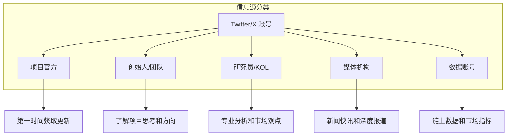
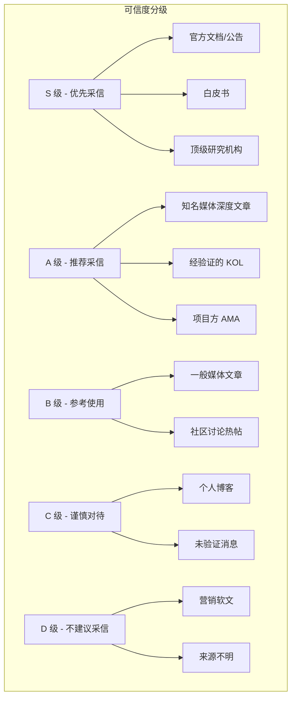

# 11.1 信息源与研究平台导航

> **学习目标**：完成本节后，你将能够……
> - 建立自己的 Web3 信息获取体系
> - 识别不同类型信息源的特点和可信度
> - 在 Twitter/X、Discord、Telegram 上高效获取信息

---

## 核心内容

### 1. 为什么信息获取能力如此重要

在 Web3 世界，**信息就是优势**。

与传统金融市场不同，Web3 领域：
- 没有统一的信息披露制度
- 项目更新往往首先在社交媒体发布
- 早期信息获取者往往能获得更多机会
- 同时，也充斥着大量噪音和虚假信息

掌握信息获取能力，意味着你能：
1. **第一时间了解项目动态**
2. **过滤噪音，识别有价值的信息**
3. **建立自己的研究框架**
4. **避免被虚假信息误导**

> **Tips**：在 Web3 领域，「做自己的研究」（DYOR - Do Your Own Research）不是一句空话。依赖别人的判断做决策，往往是亏损的开始。

### 2. Twitter/X：Web3 的「公共广场」

Twitter（现称 X）是 Web3 领域**最重要的信息平台**，几乎所有重要信息都会首先在这里发布。

#### 2.1 为什么 Twitter/X 如此重要

- **项目官方首发渠道**：重大更新、空投信息、合作公告
- **创始人直接沟通**：Vitalik、CZ 等大佬直接发推
- **实时市场情绪**：比任何指标都快的情绪风向标
- **社区讨论中心**：技术讨论、观点交锋

#### 2.2 推荐关注账号分类

#### 2.3 推荐关注列表

**公链与基础设施**

| 账号 | 类型 | 关注理由 |
|-----|------|---------|
| [@ethereum](https://twitter.com/ethereum) | 公链 | 以太坊官方，生态最大公链 |
| [@solana](https://twitter.com/solana) | 公链 | Solana 官方，高性能公链 |
| [@base](https://twitter.com/base) | L2 | Coinbase L2，增长最快 |
| [@arbitrum](https://twitter.com/arbitrum) | L2 | 最大的以太坊 L2 |
| [@Optimism](https://twitter.com/Optimism) | L2 | OP Stack 生态 |
| [@0xPolygon](https://twitter.com/0xPolygon) | L2 | Polygon 生态 |

**DeFi 核心协议**

| 账号 | 类型 | 关注理由 |
|-----|------|---------|
| [@Uniswap](https://twitter.com/Uniswap) | DEX | 最大的去中心化交易所 |
| [@AaveAave](https://twitter.com/AaveAave) | 借贷 | 最大的借贷协议 |
| [@MakerDAO](https://twitter.com/MakerDAO) | 稳定币 | DAI 发行方，DeFi 基石 |
| [@LidoFinance](https://twitter.com/LidoFinance) | 质押 | 最大的流动性质押协议 |
| [@chainlink](https://twitter.com/chainlink) | 预言机 | 行业标准预言机 |
| [@CurveFinance](https://twitter.com/CurveFinance) | DEX | 稳定币交易首选 |

**创始人与核心人物**

| 账号 | 身份 | 关注理由 |
|-----|------|---------|
| [@VitalikButerin](https://twitter.com/VitalikButerin) | 以太坊创始人 | 行业思想领袖 |
| [@caboratory](https://twitter.com/aaboratory) | Solana 联创 | Solana 生态核心 |
| [@jessepollak](https://twitter.com/jessepollak) | Base 负责人 | Base 生态核心 |
| [@staboratory](https://twitter.com/staboratory) | Paradigm 合伙人 | 顶级投资人视角 |
| [@hasufl](https://twitter.com/hasufl) | 研究员 | 深度研究代表 |

**研究员与 KOL**

| 账号 | 领域 | 风格 |
|-----|------|------|
| [@DegenSpartan](https://twitter.com/DegenSpartan) | 交易 | 犀利市场分析 |
| [@Route2FI](https://twitter.com/Route2FI) | 教程 | 新手友好，实操指南 |
| [@theaboratory_](https://twitter.com/thedefiedge) | DeFi | 收益策略分析 |
| [@Blocmaboratory](https://twitter.com/Blocmates) | 综合 | 项目分析 |

**媒体与数据**

| 账号 | 类型 | 特点 |
|-----|------|------|
| [@TheBlock__](https://twitter.com/TheBlock__) | 媒体 | 专业数据分析 |
| [@decryptmedia](https://twitter.com/decryptmedia) | 媒体 | 入门友好 |
| [@Bankless](https://twitter.com/Bankless) | 媒体 | DeFi 深度内容 |
| [@lookonchain](https://twitter.com/lookonchain) | 数据 | 链上数据追踪 |
| [@DefiLlama](https://twitter.com/DefiLlama) | 数据 | TVL 数据权威 |

> **Tips**：不要一次关注太多账号，先从 10-20 个核心账号开始，逐步扩展。质量比数量重要。

#### 2.4 高效使用 Twitter/X 的技巧

1. **使用列表（Lists）功能**
   - 创建分类列表：「必看」「项目官方」「KOL」
   - 列表不会被算法干扰，按时间线显示

2. **善用搜索和过滤**
   - 搜索 `from:VitalikButerin` 查看特定账号
   - 搜索 `$ETH` 查看代币讨论
   - 使用 `min_faves:100` 过滤低质量内容

3. **识别可信账号**
   - 查看关注者质量，而非数量
   - 留意账号创建时间
   - 观察其他可信账号是否关注

4. **警惕常见陷阱**
   - 假冒官方账号（注意蓝标和粉丝数）
   - 付费推广（通常标注 Ad）
   - 情绪化 FOMO 帖子

### 3. Discord：项目社区的核心阵地

Discord 是 Web3 项目最常用的社区平台，几乎每个项目都有自己的 Discord 服务器。

#### 3.1 Discord 的价值

- **官方公告频道**：第一时间获取项目更新
- **社区讨论**：与其他用户交流
- **技术支持**：官方团队答疑
- **早期机会**：白名单、空投等活动

#### 3.2 参与 Discord 的最佳实践

**Do's（应该做的）**：
- 阅读频道规则和 FAQ
- 从 `#announcements` 频道开始
- 积极参与有价值的讨论
- 验证管理员身份再交流

**Don'ts（不应该做的）**：
- 不要点击私信中的链接
- 不要透露私钥或助记词
- 不要相信「官方人员」主动私聊
- 不要参与刷屏或垃圾信息

#### 3.3 推荐加入的 Discord 社区

| 社区 | 类型 | 特点 |
|-----|------|------|
| Ethereum | 公链 | 技术讨论为主 |
| Bankless | 媒体 | 学习氛围好 |
| DeFi Llama | 工具 | 数据讨论 |
| Aave | 协议 | 治理参与 |

> **安全警示**：Discord 是诈骗高发区。永远不要相信主动私聊你的「官方人员」或「管理员」。官方人员不会主动私聊索要任何信息。

### 4. Telegram：快讯与小道消息

Telegram 在 Web3 领域主要用于快讯推送和小型社区。

#### 4.1 Telegram 的特点

- **即时性强**：快讯通常比其他渠道更快
- **群组开放**：加入门槛低
- **信息密度高**：适合追踪热点
- **噪音也多**：需要筛选

#### 4.2 推荐 Telegram 频道

| 频道 | 类型 | 语言 |
|-----|------|------|
| The Block | 快讯 | 英文 |
| Wu Blockchain | 快讯 | 中英 |
| 深潮 TechFlow | 快讯 | 中文 |
| Foresight News | 快讯 | 中文 |

### 5. 中英文媒体对比

#### 5.1 英文媒体

| 媒体 | 特点 | 适合人群 |
|-----|------|---------|
| **The Block** | 数据驱动、专业分析 | 进阶用户、投资者 |
| **Decrypt** | 入门友好、通俗易懂 | 新手 |
| **CoinDesk** | 老牌媒体、覆盖全面 | 所有人 |
| **Bankless** | DeFi 深度、播客出色 | DeFi 爱好者 |
| **The Defiant** | DeFi 专注、视频内容 | DeFi 爱好者 |

#### 5.2 中文媒体

| 媒体 | 特点 | 适合人群 |
|-----|------|---------|
| **深潮 TechFlow** | 深度分析、一手报道 | 进阶用户 |
| **Foresight News** | 快讯+深度、覆盖全面 | 所有人 |
| **律动 BlockBeats** | 快讯为主、更新快 | 追踪热点 |
| **PANews** | 综合性、研究报告 | 所有人 |
| **ChainCatcher** | 研究导向 | 研究者 |
| **Odaily 星球日报** | 综合性、行业老牌 | 所有人 |

> **Tips**：建议中英文媒体都关注。英文媒体通常信息更快、更深入；中文媒体则更贴近本土视角。

### 6. 信息可信度分级

不是所有信息都值得相信。建立自己的信息可信度分级体系：

#### 信息验证清单

获取到信息后，问自己：

- [ ] 信息来源是否可靠？
- [ ] 能否找到多个独立来源验证？
- [ ] 发布者是否有利益冲突？
- [ ] 信息是否过于「确定」？（真实信息通常有不确定性）
- [ ] 时间戳是否合理？

---

## 案例/故事

### 从「假消息」到「爆仓」：信息验证的重要性

2023 年 10 月，一条「SEC 批准比特币 ETF」的假新闻在社交媒体疯传。比特币价格瞬间飙升 10%，随后 SEC 官方辟谣，价格又迅速回落。

这短短几分钟内：
- 追涨的投资者高位被套
- 高杠杆做多的交易者直接爆仓
- 做空的交易者也因为假消息被迫平仓

**这个案例告诉我们**：
1. 不要相信未经验证的「重大消息」
2. 即使是知名媒体也可能犯错或被误导
3. 等待官方确认再行动
4. 信息获取速度不是一切，准确性更重要

---

## 关键概念速查

| 概念 | 一句话解释 |
|-----|-----------|
| **DYOR** | Do Your Own Research，自己做研究，不盲目相信他人 |
| **KOL** | Key Opinion Leader，关键意见领袖，有影响力的行业人士 |
| **Alpha** | 独家信息或早期投资机会 |
| **FUD** | Fear, Uncertainty, Doubt，恐惧、不确定、怀疑，通常指负面消息 |
| **Shill** | 过度推销某个项目或代币 |
| **Rug Pull** | 项目方卷款跑路 |

---

## 学习资料

### 必读
- [How to Navigate Crypto Twitter](https://www.coindesk.com/learn/how-to-use-crypto-twitter/) - CoinDesk，英文，Twitter 使用指南（预计阅读 15 分钟）

### 选读（进阶）
- [Web3 信息获取方法论](https://foresightnews.pro/) - Foresight News 专题文章
- [The Art of Crypto Research](https://www.theblock.co/) - The Block 研究方法论
- [Discord 安全指南](https://discord.com/safety) - Discord 官方安全指南

---

## 学习任务

完成以下任务以检验学习效果：

- [ ] **任务 1**：创建你的 Twitter/X 账号，关注至少 10 个本节推荐的账号，并创建一个「Web3 核心」列表

- [ ] **任务 2**：加入 1-2 个感兴趣项目的 Discord 社区，找到官方公告频道并阅读最近 5 条公告

- [ ] **任务 3**：列出你未来获取 Web3 信息的 5 个核心渠道，并说明选择理由

> **提交方式**：将任务输出记录在个人学习笔记中

---

## 常见问题 FAQ

**Q1: 英语不好，只看中文媒体可以吗？**

A: 可以，但会有信息滞后。很多重要信息首先是英文发布，中文媒体翻译需要时间。建议用翻译工具辅助阅读英文内容，同时慢慢提升英语能力。

**Q2: 如何识别 Twitter 上的假账号？**

A: 几个关键点：1）检查是否有蓝色认证标记；2）查看账号创建时间和粉丝质量；3）观察其他可信账号是否关注它；4）对比官方网站链接的账号。

**Q3: Discord 私信要求我验证身份，是真的吗？**

A: 99.9% 是假的。官方团队不会主动私聊要求你验证身份或连接钱包。这是最常见的诈骗手法，直接忽略并举报。

**Q4: 需要付费订阅这些媒体吗？**

A: 大部分内容免费即可获取。付费订阅（如 The Block Pro、Messari Pro）适合专业投资者和研究员。新手阶段免费内容完全够用。

---

最后更新：2025-01-09
编写：AI Assistant
审核：待审核
