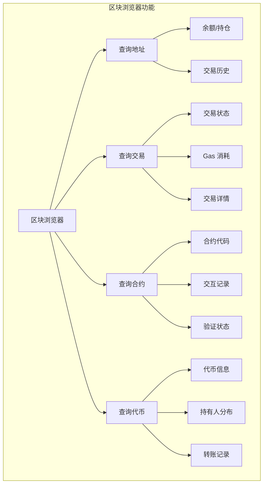
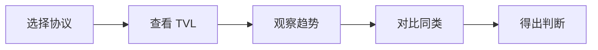

# 11.2 数据工具与浏览器使用指引

> **学习目标**：完成本节后，你将能够……
> - 使用区块浏览器查询地址、交易和合约信息
> - 使用 DefiLlama 等工具分析 DeFi 协议
> - 使用 DeBank 追踪钱包持仓

---

## 核心内容

### 1. 为什么需要这些工具

区块链的数据是公开透明的，但原始数据难以阅读。数据工具帮助我们：

- **验证交易**：确认转账是否成功
- **研究项目**：分析协议数据和趋势
- **追踪资金**：观察大户动向和资金流
- **发现机会**：识别早期项目和趋势

> **Tips**：这些工具是「链上侦探」的必备装备。掌握它们，你就拥有了独立研究的能力。

### 2. 区块浏览器：区块链的「搜索引擎」

区块浏览器（Block Explorer）是查询区块链数据的基础工具，每条公链都有对应的浏览器。

#### 2.1 主流区块浏览器

| 公链 | 浏览器名称 | 网址 |
|-----|-----------|------|
| Ethereum | Etherscan | [etherscan.io](https://etherscan.io) |
| Solana | Solscan | [solscan.io](https://solscan.io) |
| BNB Chain | BscScan | [bscscan.com](https://bscscan.com) |
| Arbitrum | Arbiscan | [arbiscan.io](https://arbiscan.io) |
| Base | Basescan | [basescan.org](https://basescan.org) |
| Polygon | Polygonscan | [polygonscan.com](https://polygonscan.com) |
| Optimism | Optimistic Etherscan | [optimistic.etherscan.io](https://optimistic.etherscan.io) |
| Avalanche | Snowtrace | [snowtrace.io](https://snowtrace.io) |

> **Tips**：大部分 EVM 兼容链的浏览器界面类似 Etherscan，学会一个就能触类旁通。

#### 2.2 区块浏览器能做什么

#### 2.3 Etherscan 使用教程

**场景 1：查询钱包地址**

1. 打开 [etherscan.io](https://etherscan.io)
2. 在搜索框输入钱包地址（0x 开头的 42 位字符）
3. 查看页面信息：
   - **Balance**：ETH 余额
   - **Token**：持有的代币
   - **Transactions**：交易记录

**场景 2：验证交易状态**

1. 输入交易哈希（Transaction Hash / Txn Hash）
2. 查看关键字段：
   - **Status**：Success（成功）或 Failed（失败）
   - **Block**：交易被打包进的区块
   - **From / To**：发送方和接收方
   - **Value**：转账金额
   - **Transaction Fee**：实际支付的 Gas 费

**场景 3：查看智能合约**

1. 输入合约地址
2. 点击「Contract」标签
3. 查看：
   - **Verified**：是否已验证（绿色勾表示已验证）
   - **Source Code**：合约源代码
   - **Read Contract**：读取合约状态
   - **Write Contract**：与合约交互

> **安全提示**：与合约交互前，务必确认合约已验证（Verified）。未验证的合约可能存在风险。

#### 2.4 如何识别可疑地址

区块浏览器经常会标注一些风险地址：

| 标签 | 含义 | 建议 |
|-----|------|------|
| Fake_Phishing | 钓鱼地址 | 立即远离 |
| Exploit | 黑客地址 | 立即远离 |
| Blocked | 被制裁地址 | 不要交互 |
| (无标签) | 未知地址 | 谨慎判断 |

### 3. DeFi 数据平台

#### 3.1 DefiLlama - TVL 数据权威

[DefiLlama](https://defillama.com) 是 DeFi 领域最权威的数据聚合平台。

**核心功能**：

| 功能 | 用途 | 路径 |
|-----|------|------|
| TVL 排名 | 查看协议规模 | 首页 |
| 链 TVL | 对比各链生态 | Chains |
| 收益率 | 查找理财机会 | Yields |
| 稳定币 | 追踪稳定币数据 | Stablecoins |
| DEX 交易量 | DEX 活跃度对比 | DEXs |
| 费用收入 | 协议盈利能力 | Fees/Revenue |

**实操案例：研究一个 DeFi 协议**

以研究 Aave 为例：

1. 打开 DefiLlama，搜索「Aave」
2. 查看关键指标：
   - **TVL**：锁仓总额，反映协议规模
   - **TVL 变化**：7d/30d 变化趋势
   - **链分布**：在哪些链部署
3. 点击「Chains」查看各链 TVL 分布
4. 对比同类协议（如 Compound）

> **Tips**：TVL 不是唯一指标。高 TVL 不等于好项目，还需要结合收入、用户数等综合判断。

#### 3.2 Dune Analytics - 链上数据分析

[Dune](https://dune.com) 是一个基于 SQL 的链上数据分析平台。

**特点**：
- 用 SQL 查询区块链数据
- 社区创建的大量现成仪表板
- 可视化图表展示

**适用场景**：
- 追踪特定指标的历史趋势
- 分析用户行为和资金流向
- 自定义数据分析

**新手使用建议**：

1. 先从社区仪表板开始
   - 在搜索栏搜索项目名或主题
   - 找到高 Star 的仪表板
   - 学习别人的数据视角

2. 推荐仪表板
   - [DEX 交易量总览](https://dune.com/hagaetc/dex-metrics)
   - [NFT 市场数据](https://dune.com/hildobby/NFTs)
   - [L2 数据对比](https://dune.com/Henrystats/layer-2-metrics)

> **Tips**：Dune 的门槛稍高，需要一定 SQL 基础。新手可以先使用别人创建的仪表板。

#### 3.3 Token Terminal - 协议财务分析

[Token Terminal](https://tokenterminal.com) 用传统金融视角分析 Web3 协议。

**核心指标**：

| 指标 | 含义 | 重要性 |
|-----|------|--------|
| Revenue | 协议收入 | 衡量盈利能力 |
| Fees | 用户支付的费用 | 反映使用量 |
| TVL | 锁仓资金 | 协议规模 |
| P/F Ratio | 价格/费用比 | 估值参考 |
| P/S Ratio | 价格/营收比 | 估值参考 |

**使用场景**：评估协议「是否赚钱」

> **注意**：部分功能需要付费订阅。免费版可以查看基础数据。

### 4. 钱包追踪工具

#### 4.1 DeBank - 免费的多链钱包追踪

[DeBank](https://debank.com) 是最常用的钱包追踪工具。

**核心功能**：

- **查看任意地址持仓**：输入地址即可查看
- **多链资产汇总**：一站式查看所有链的资产
- **DeFi 持仓详情**：显示在各协议的存款、借款等
- **NFT 持仓**：查看持有的 NFT
- **交易历史**：完整的交易记录

**实操案例：追踪「聪明钱」**

1. 获取知名投资人或大户的钱包地址
   - 从推特公开信息
   - 从 Arkham 等平台的标签
2. 在 DeBank 输入地址
3. 分析：
   - 他们持有什么代币？
   - 他们在用什么 DeFi 协议？
   - 最近有什么交易？

> **安全提示**：追踪大户仅供参考，不能盲目跟单。大户有时会故意做出误导性操作。

#### 4.2 Nansen - 专业级链上分析

[Nansen](https://www.nansen.ai) 是专业的链上数据分析平台。

**核心特点**：
- **智能标签**：为地址标注身份（如「鲸鱼」「DEX 交易者」）
- **聪明钱追踪**：识别表现优异的地址
- **NFT 分析**：蓝筹 NFT 持有者追踪

**定价**：主要功能需要付费（$150+/月），有部分免费内容。

**适用人群**：专业投资者、研究员

#### 4.3 Arkham Intelligence - 链上侦探

[Arkham](https://www.arkhamintelligence.com) 专注于地址身份识别和资金追踪。

**核心特点**：
- **实体标签**：识别地址背后的真实身份
- **可视化资金流**：追踪资金来龙去脉
- **告警功能**：监控特定地址动向

**使用场景**：
- 追查黑客资金流向
- 识别项目方钱包
- 分析大户行为

### 5. 工具对比与选择

#### 5.1 按用途选择工具

| 需求 | 推荐工具 | 备注 |
|-----|---------|------|
| 查交易、验证地址 | Etherscan 系列 | 基础必备 |
| 看 DeFi 数据 | DefiLlama | 免费全面 |
| 追踪钱包持仓 | DeBank | 免费好用 |
| 深度数据分析 | Dune | 需要 SQL 基础 |
| 协议财务分析 | Token Terminal | 部分付费 |
| 专业级追踪 | Nansen / Arkham | 付费为主 |

#### 5.2 新手建议工具组合

**免费组合（推荐新手）**：
1. **Etherscan**：基础查询
2. **DefiLlama**：DeFi 研究
3. **DeBank**：钱包追踪

这三个工具可以满足 90% 的日常需求。

---

## 案例/故事

### 用链上数据追踪 FTX 暴雷

2022 年 11 月 FTX 暴雷时，链上侦探们通过数据工具发现了关键线索：

1. **Arkham 追踪**：识别出 FTX 和 Alameda 相关地址
2. **Etherscan 观察**：发现大量资金异常转移
3. **Nansen 分析**：追踪资金流向多个交易所
4. **社区接力**：推特上的链上分析师实时直播追踪

这个事件展示了链上数据工具的威力——在官方承认问题之前，链上数据已经揭示了真相。

**启示**：学会使用这些工具，你就拥有了独立验证的能力，不用完全依赖项目方或媒体的说法。

---

## 关键概念速查

| 概念 | 一句话解释 |
|-----|-----------|
| **区块浏览器** | 查询区块链数据的网页工具，如 Etherscan |
| **TVL** | Total Value Locked，锁仓总额，衡量 DeFi 协议规模 |
| **交易哈希** | Transaction Hash，交易的唯一标识符 |
| **Gas** | 以太坊网络的交易手续费单位 |
| **智能钱包** | 表现优异的链上地址，被认为是「聪明钱」 |
| **仪表板** | Dashboard，数据可视化页面 |

---

## 学习资料

### 必读
- [How to Use a Block Explorer](https://www.coinbase.com/learn/tips-and-tutorials/how-to-use-a-block-explorer) - Coinbase Learn，英文，区块浏览器入门（预计阅读 10 分钟）
- [DefiLlama 官方文档](https://docs.llama.fi/) - 了解 DefiLlama 功能

### 选读（进阶）
- [Dune Analytics 入门教程](https://docs.dune.com/getting-started/quickstart) - 学习 SQL 数据分析
- [链上分析方法论](https://www.nansen.ai/research) - Nansen 研究报告
- [Arkham 使用指南](https://docs.arkhamintelligence.com/) - 链上侦探入门

---

## 学习任务

完成以下任务以检验学习效果：

- [ ] **任务 1**：在 Etherscan 上查询你自己的钱包地址（或任意地址），记录余额、最近 3 笔交易

- [ ] **任务 2**：在 DefiLlama 上找到当前 TVL 排名前 5 的 DeFi 协议，并记录它们分别属于什么类型（DEX/借贷/收益等）

- [ ] **任务 3**：在 DeBank 上查看一个知名地址（可以是 Vitalik 的地址：0xd8dA6BF26964aF9D7eEd9e03E53415D37aA96045），观察其持仓分布

> **提交方式**：将任务输出截图或记录在个人学习笔记中

---

## 常见问题 FAQ

**Q1: 区块浏览器会收费吗？**

A: 基础功能全部免费。Etherscan 等也提供付费 API 服务，但普通用户不需要。

**Q2: 为什么我的交易在浏览器上显示 Pending？**

A: Pending 表示交易尚未被确认。可能原因：Gas 费设置太低、网络拥堵。可以等待或用更高 Gas 费发起替换交易。

**Q3: DefiLlama 的数据准确吗？**

A: DefiLlama 是行业最权威的数据源之一，但不保证 100% 准确。部分项目可能有数据更新延迟或统计口径差异。

**Q4: 这些工具会泄露我的隐私吗？**

A: 这些工具只是读取公开的区块链数据，不会获取你的私钥或个人信息。但如果你的地址与身份关联，别人可以追踪你的交易历史。

---

最后更新：2025-01-09
编写：Antony
审核：待审核
