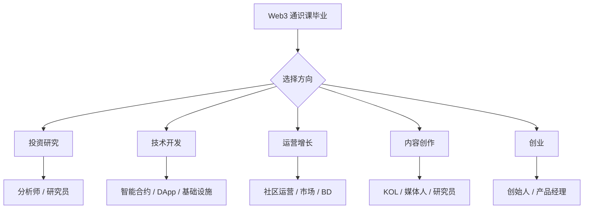
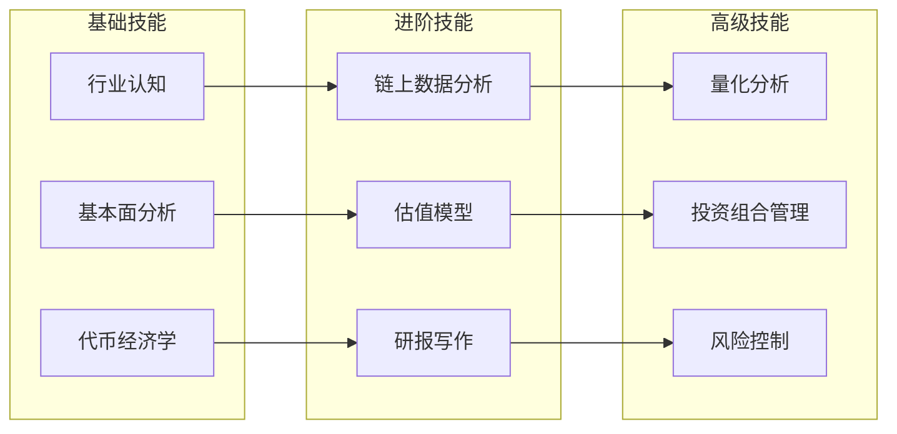
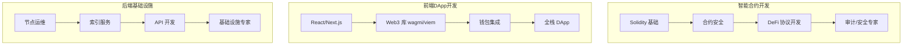
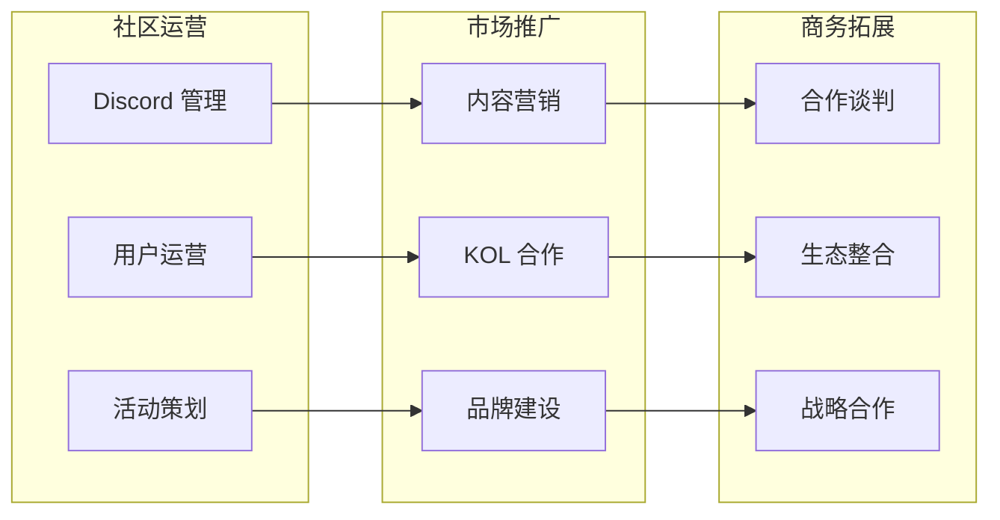
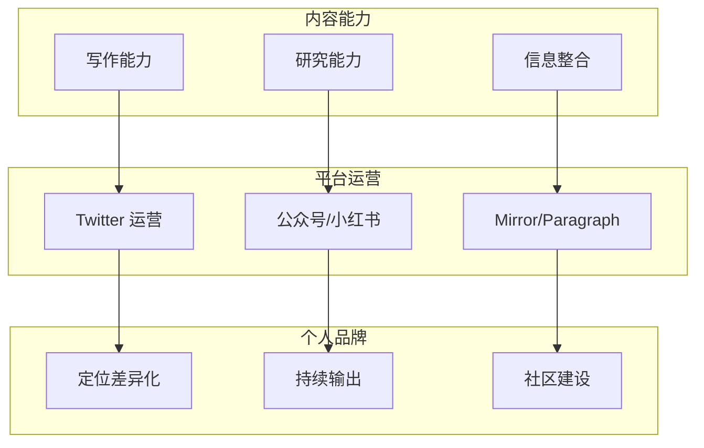
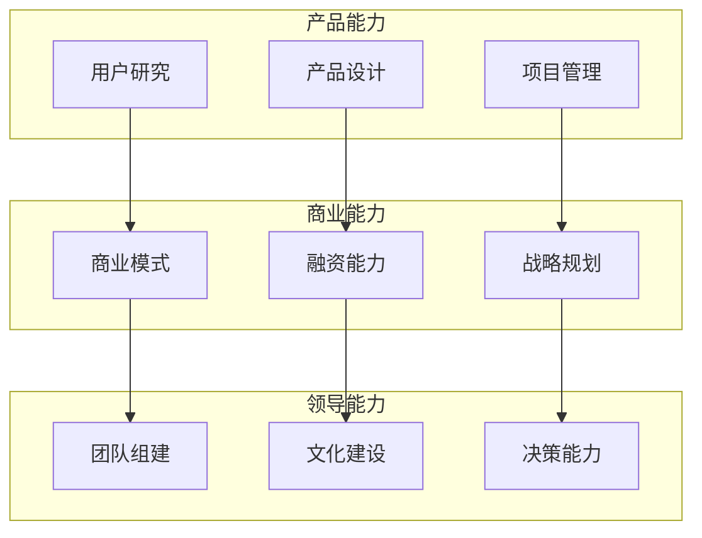

# 11.4 不同方向的进阶学习路线图

> **学习目标**：完成本节后，你将能够……
> - 了解 Web3 领域的主要发展方向
> - 选择适合自己的进阶路径
> - 获得具体可操作的学习计划

---

## 核心内容

### 1. 选择你的方向

完成通识课后，你可能会问：**接下来怎么办？**

Web3 领域有多个发展方向，每个方向需要的技能不同：

> **Tips**：不必现在就确定唯一方向。可以先探索 1-2 个感兴趣的领域，再做决定。

---

### 2. 投资研究方向

**适合人群**：对市场分析、数据研究、投资决策感兴趣

**职业出口**：加密基金研究员、独立分析师、投资顾问

#### 2.1 技能树

#### 2.2 学习路线

| 阶段 | 目标 | 学习内容 | 推荐资源 |
|-----|------|---------|---------|
| **基础** | 建立分析框架 | 代币经济学、项目评估框架 | Messari 入门课程 |
| **进阶** | 掌握分析工具 | Dune、DefiLlama、链上分析 | Dune 教程、Nansen 研报 |
| **实战** | 输出研报 | 研报写作、模型构建 | 模仿头部研报格式 |
| **深入** | 建立影响力 | 发布研究、建立个人品牌 | Twitter/Mirror 输出 |

#### 2.3 第一步行动

1. 选择 3 个感兴趣的项目
2. 用以下框架分析：
   - 解决什么问题？
   - 代币有什么用途？
   - 团队背景如何？
   - 竞品对比如何？
3. 写一份 1 页的分析笔记
4. 发布在 Twitter 或 Mirror

---

### 3. 技术开发方向

**适合人群**：有编程基础或愿意学习编程

**职业出口**：智能合约开发、DApp 前端、协议工程师

#### 3.1 三条技术路线

#### 3.2 智能合约开发路线

| 阶段 | 目标 | 学习内容 | 推荐资源 |
|-----|------|---------|---------|
| **入门** | 理解智能合约 | Solidity 语法、EVM 基础 | CryptoZombies |
| **基础** | 能写简单合约 | ERC20/721、基础模式 | Solidity by Example |
| **进阶** | 理解 DeFi 协议 | Uniswap/Aave 源码 | 协议文档+源码 |
| **安全** | 避免常见漏洞 | 安全最佳实践、审计 | Damn Vulnerable DeFi |
| **实战** | 部署真实项目 | 测试网部署、主网部署 | Foundry/Hardhat |

**推荐工具栈**：
- 开发框架：Foundry（推荐）或 Hardhat
- 测试：Forge Test
- 部署：Foundry Script
- 安全：Slither、Aderyn

#### 3.3 前端 DApp 开发路线

| 阶段 | 目标 | 学习内容 | 推荐资源 |
|-----|------|---------|---------|
| **前置** | Web 开发基础 | React、TypeScript | React 官方教程 |
| **入门** | 连接钱包 | wagmi、RainbowKit | wagmi 文档 |
| **进阶** | 读写合约 | 合约交互、状态管理 | viem 文档 |
| **实战** | 完整 DApp | 前后端整合 | Scaffold-ETH |

#### 3.4 第一步行动

**智能合约**：
1. 完成 CryptoZombies 前 3 章
2. 在 Remix 中写一个简单的投票合约
3. 部署到 Sepolia 测试网

**前端 DApp**：
1. 用 Create React App 创建项目
2. 集成 RainbowKit 实现钱包连接
3. 读取你钱包的 ETH 余额并显示

---

### 4. 运营增长方向

**适合人群**：擅长沟通、喜欢社区互动、有营销背景

**职业出口**：社区经理、增长负责人、BD、市场总监

#### 4.1 技能树

#### 4.2 学习路线

| 阶段 | 目标 | 学习内容 | 实践方式 |
|-----|------|---------|---------|
| **体验** | 了解社区运作 | 加入项目 Discord、观察优秀社区 | 活跃参与 3-5 个社区 |
| **实践** | 获得运营经验 | 成为 Mod、参与志愿者 | 申请项目志愿者岗位 |
| **进阶** | 独立运营能力 | 活动策划、用户增长 | 运营小型社区/项目 |
| **专业** | 团队管理 | 团队建设、预算管理 | 加入项目核心团队 |

#### 4.3 第一步行动

1. 选择 2-3 个喜欢的项目
2. 加入它们的 Discord 并活跃参与
3. 观察社区如何运营、Mod 如何管理
4. 申请成为志愿者或 Mod

---

### 5. 内容创作方向

**适合人群**：喜欢写作、擅长表达、有研究能力

**职业出口**：独立 KOL、媒体编辑、研究员

#### 5.1 技能树

#### 5.2 学习路线

| 阶段 | 目标 | 内容 | 建议 |
|-----|------|------|------|
| **起步** | 开始输出 | 学习笔记、项目分析 | 每周 1-2 篇 |
| **定位** | 找到差异化 | 确定细分领域 | DeFi/NFT/L2 等 |
| **成长** | 建立影响力 | 持续输出、互动 | 坚持 3-6 个月 |
| **变现** | 商业化 | 付费内容、咨询、合作 | 有影响力后自然来 |

#### 5.3 内容形式选择

| 形式 | 平台 | 特点 | 适合人群 |
|-----|------|------|---------|
| 推文/Thread | Twitter | 短平快、传播广 | 有观点、会表达 |
| 长文 | Mirror/公众号 | 深度、沉淀 | 擅长写作 |
| 视频 | YouTube/B站 | 直观、粉丝粘性 | 有表达欲、愿出镜 |
| 播客 | 小宇宙等 | 陪伴感、深度访谈 | 善于交流 |

#### 5.4 第一步行动

1. 注册 Twitter 和一个长文平台（Mirror 或公众号）
2. 确定你要输出的领域（如「DeFi 新手入门」）
3. 写你的第一篇内容（可以是课程学习笔记）
4. 发布并分享给朋友，收集反馈

---

### 6. 创业方向

**适合人群**：有创业想法、愿意承担风险、有领导力

**职业出口**：项目创始人、产品经理、核心团队成员

#### 6.1 能力模型

#### 6.2 创业路径

| 阶段 | 重点 | 行动 |
|-----|------|------|
| **探索期** | 找到问题 | 深度使用产品、发现痛点 |
| **验证期** | 验证需求 | MVP 测试、用户访谈 |
| **启动期** | 组建团队 | 找联创、搭建核心团队 |
| **融资期** | 获取资源 | 种子轮融资、Grant 申请 |
| **增长期** | 规模化 | 用户增长、产品迭代 |

#### 6.3 第一步行动

1. 记录你在使用 Web3 产品时遇到的问题
2. 思考：有没有更好的解决方案？
3. 和 5 个潜在用户聊聊这个问题
4. 如果有需求，尝试做一个最简单的原型

---

### 7. 方向选择建议

#### 7.1 根据背景选择

| 你的背景 | 推荐方向 |
|---------|---------|
| 金融/投资 | 投资研究 |
| 程序员/CS 背景 | 技术开发 |
| 市场/运营 | 运营增长 |
| 媒体/内容 | 内容创作 |
| 创业经历 | 创业 |
| 无特定背景 | 先从内容创作或社区运营开始 |

#### 7.2 根据目标选择

| 你的目标 | 推荐方向 |
|---------|---------|
| 快速入行 | 运营增长（门槛相对低） |
| 高薪酬 | 技术开发（需求大、薪资高） |
| 灵活自由 | 内容创作（可兼职/远程） |
| 财务自由 | 创业（高风险高回报） |
| 深度理解行业 | 投资研究 |

#### 7.3 通用建议

无论选择哪个方向：

1. **先做，再优化**：不要等到「准备好了」才开始
2. **建立作品集**：有可展示的成果比简历更重要
3. **加入社区**：在圈内建立人脉
4. **保持学习**：Web3 变化快，持续学习是必须的
5. **小步试错**：先兼职尝试，验证后再全职投入

---

## 案例/故事

### 从 Web2 产品经理到 Web3 创始人

2021 年，一位在字节跳动工作的产品经理小王开始对 Web3 产生兴趣。

他的转型路径：

1. **学习阶段（3 个月）**
   - 业余时间学习，阅读白皮书和研报
   - 在 DeFi 协议中小额实操
   - 加入 DAO 参与治理

2. **输出阶段（3 个月）**
   - 开始在 Twitter 分享学习笔记
   - 写了几篇 DeFi 产品分析
   - 逐渐建立了一些 follower

3. **实践阶段（6 个月）**
   - 加入一个 DAO 做兼职产品顾问
   - 认识了潜在的联合创始人
   - 发现了一个产品机会

4. **创业阶段**
   - 辞职全职创业
   - 获得了种子轮融资
   - 开始组建团队

**关键经验**：
- 不需要一步到位，渐进式转型更稳健
- 输出内容帮助他建立了人脉和信任
- 实际参与比纯学习更有价值

---

## 关键概念速查

| 概念 | 一句话解释 |
|-----|-----------|
| **技能树** | 某个领域需要掌握的技能层级和学习顺序 |
| **Solidity** | 以太坊智能合约的主要编程语言 |
| **wagmi** | React 生态的 Web3 开发库 |
| **KOL** | Key Opinion Leader，有影响力的意见领袖 |
| **MVP** | Minimum Viable Product，最小可行产品 |

---

## 学习资料

### 必读
- [a16z Crypto Startup School](https://a16z.com/crypto-startup-school/) - 创业方向必看
- [CryptoZombies](https://cryptozombies.io/) - 技术方向入门

### 选读（进阶）
- [How to Start a Startup](https://startupclass.samaltman.com/) - YC 创业课程
- [Alchemy University](https://university.alchemy.com/) - 技术开发完整课程
- [Web3 创作者指南](https://mirror.xyz/) - 内容创作参考

---

## 学习任务

完成以下任务以检验学习效果：

- [ ] **任务 1**：选择 1-2 个你感兴趣的方向，说明选择理由（结合你的背景和目标）

- [ ] **任务 2**：根据你选择的方向，制定一份 30 天学习计划，包含具体的学习内容和产出目标

- [ ] **任务 3**：完成你选择方向的「第一步行动」，并记录完成情况

> **提交方式**：将任务输出记录在个人学习笔记中

---

## 常见问题 FAQ

**Q1: 我对多个方向都感兴趣，怎么选？**

A: 先选一个作为主要方向深入，其他作为辅助。比如选择「技术开发」为主，同时「内容创作」分享学习过程。不必一开始就锁定唯一方向。

**Q2: 没有相关背景，能转型成功吗？**

A: 完全可以。Web3 行业还很年轻，大多数人都是从其他行业转型来的。关键是有热情、愿意学习、能持续输出。

**Q3: 学习周期需要多久？**

A: 取决于方向和投入程度。入门通常需要 3-6 个月持续学习，达到可工作水平可能需要 6-12 个月。但不要等到「学完」再开始实践，边学边做更有效。

**Q4: Web3 现在还是好的入行时机吗？**

A: 行业有周期，但长期看，区块链技术和 Web3 理念仍在发展。熊市是学习和积累的好时机，等到牛市机会会更多。

---

最后更新：2025-01-09
编写：AI Assistant
审核：待审核
