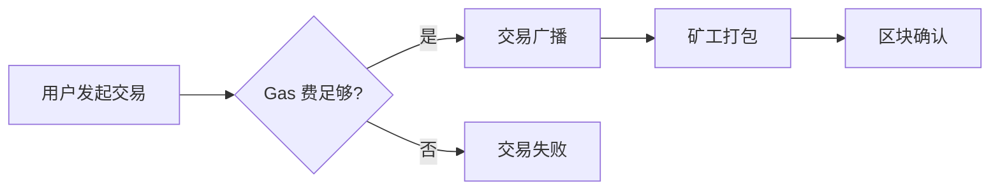
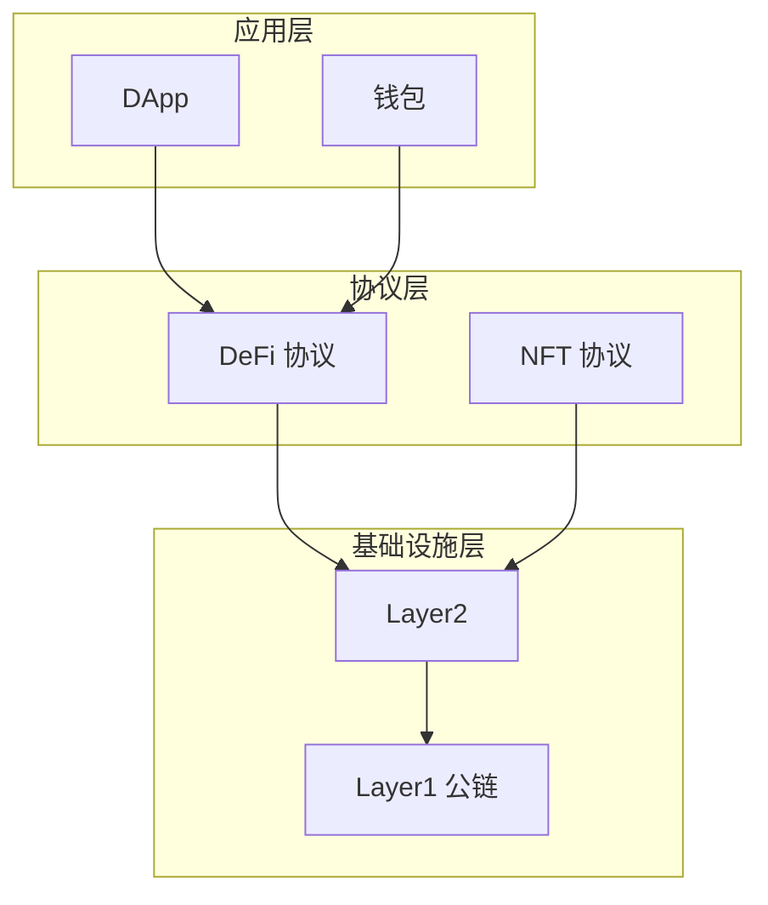
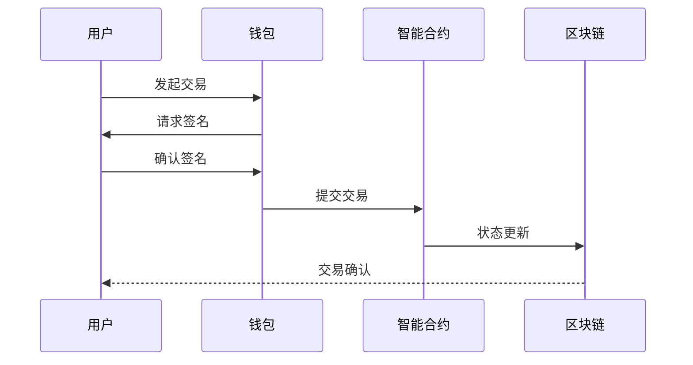
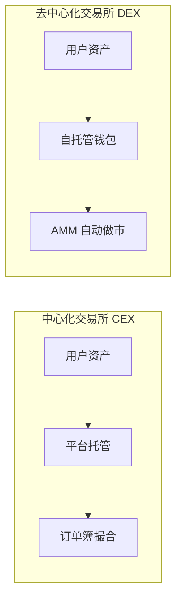

# Web3 通识课 - 内容研发规范

> 本文档定义了课程内容的研发流程与资料引用规范，确保每一节课的内容有据可循、质量可控。

---

## 1. 核心原则

- **有据可循**：每个知识点都应有可溯源的资料支撑
- **站在巨人肩膀上**：充分利用已有的优质内容，专注于整合与转化
- **透明引用**：让学员知道知识从哪里来，方便进一步学习
- **批判吸收**：不盲目引用，需验证和对比多个来源

---

## 2. 内容研发流程

每节课的研发遵循以下 5 个步骤：

```
┌─────────────────────────────────────────────────────────────┐
│  1. 搜索收集  →  2. 筛选评估  →  3. 提炼整合  →  4. 转化表达  →  5. 附注来源  │
└─────────────────────────────────────────────────────────────┘
```

### 2.1 搜索收集

**目标**：针对章节主题，广泛收集相关资料

**搜索平台**：

| 类型 | 平台 | 适用场景 |
|-----|------|---------|
| 官方文档 | 项目官网、GitHub、白皮书 | 技术细节、机制原理 |
| 教育平台 | Binance Academy、Coinbase Learn | 入门概念、基础知识 |
| 中文媒体 | Foresight News、律动、深潮 | 中文解读、本土视角 |
| 英文媒体 | The Block、Decrypt、CoinDesk | 行业动态、深度分析 |
| 研究平台 | Messari、Delphi Digital、Galaxy | 研报、数据分析 |
| 社交媒体 | Twitter/X、Mirror | KOL 观点、一手信息 |
| 视频平台 | YouTube、B 站 | 可视化讲解 |
| 数据平台 | DefiLlama、Dune、Token Terminal | 数据支撑 |

**搜索策略**：

1. **中英文双搜**：同一概念用中英文分别搜索
2. **关键词组合**：`概念名 + 解释/explained/tutorial/guide`
3. **时间过滤**：优先近 1-2 年的内容（Web3 变化快）
4. **多平台交叉**：不依赖单一来源

**建议收集数量**：
- 每个核心知识点：3-5 篇相关资料
- 每节课总计：8-15 篇资料

### 2.2 筛选评估

**目标**：从收集的资料中筛选出高质量来源

**质量评估维度**：

| 维度 | 高质量标志 | 低质量警示 |
|-----|-----------|-----------|
| 来源可信度 | 官方/知名媒体/专业研究机构 | 不明来源、营销号 |
| 内容准确性 | 有数据支撑、逻辑清晰 | 明显错误、自相矛盾 |
| 时效性 | 近期发布或持续更新 | 过时信息（尤其技术类） |
| 深度与广度 | 解释透彻、覆盖全面 | 浅尝辄止、以偏概全 |
| 客观性 | 中立分析、呈现多面 | 明显偏见、过度营销 |

**来源可信度分级**：

```
S 级（优先引用）：官方文档、白皮书、顶级研究机构
A 级（推荐引用）：Binance Academy、知名媒体深度文章、经验证的 KOL
B 级（参考使用）：一般媒体文章、社区讨论
C 级（谨慎使用）：个人博客、未经验证的信息
D 级（不建议）：营销软文、来源不明
```

### 2.3 提炼整合

**目标**：从多个来源中提取核心观点，形成结构化认知

**操作方法**：

1. **建立知识点清单**：列出本节需要覆盖的所有知识点
2. **交叉验证**：每个知识点至少 2 个来源相互印证
3. **识别共识与争议**：
   - 共识观点 → 作为课程核心内容
   - 争议观点 → 呈现不同视角，标注「存在争议」
4. **补充空白**：发现资料未覆盖的点，继续搜索

**整合输出格式**（研发笔记）：

```markdown
## 知识点：[名称]

### 核心定义
[综合多个来源后的定义]

### 关键要点
1. ...
2. ...

### 来源对比
| 来源 | 观点 | 可信度 |
|-----|------|--------|
| 来源A | ... | S |
| 来源B | ... | A |

### 存在争议（如有）
- 观点 1：...
- 观点 2：...
```

### 2.4 转化表达

**目标**：将整合后的内容转化为课程语言

**转化原则**：

1. **降维解释**：用简单语言解释复杂概念
2. **类比优先**：用生活类比帮助理解
3. **结构清晰**：遵循「课程文档编写规范」的结构
4. **保留精华**：原文特别精彩的表达可以引用

**引用 vs 转述**：

| 场景 | 处理方式 |
|-----|---------|
| 概念定义 | 综合多来源，用自己的话重新表达 |
| 精彩观点 | 直接引用，标注来源 |
| 数据事实 | 直接引用，标注来源和时间 |
| 案例故事 | 可转述，标注原始来源 |

### 2.5 附注来源

**目标**：在文档中清晰标注资料来源

详见「第 4 节：引用与标注规范」

---

## 3. 资料分类管理

### 3.1 研发资料存放

每个 Part 文件夹下创建 `_research/` 目录存放研发资料：

```
Part05-主流赛道与商业模式/
├── _research/                    # 研发资料（不对外发布）
│   ├── 5.1-DeFi-研发笔记.md
│   ├── 5.1-DeFi-资料清单.md
│   └── ...
├── assets/
├── 5.1-DeFi去中心化金融.md      # 正式课程文档
└── ...
```

### 3.2 研发笔记模板

每节课创建一份研发笔记，记录研发过程：

```markdown
# [章节编号] [章节标题] - 研发笔记

## 研发信息
- 研发人：
- 研发日期：
- 预计完成：

## 1. 收集的资料

### 官方/权威来源
- [ ] [资料标题](链接) - 简述内容 - 可信度等级

### 媒体/教程
- [ ] [资料标题](链接) - 简述内容 - 可信度等级

### 数据/案例
- [ ] [资料标题](链接) - 简述内容 - 可信度等级

## 2. 知识点整合

### 知识点 1：[名称]
**定义**：
**要点**：
**来源**：

### 知识点 2：[名称]
...

## 3. 存在的争议或不确定点

- [ ] ...

## 4. 筛选出的优质资源（用于正式文档）

### 必读
- [资料名称](链接) - 选择理由

### 选读
- [资料名称](链接) - 选择理由

## 5. 研发备注

[其他需要记录的内容]
```

---

## 4. 引用与标注规范

### 4.1 正文中的引用

**直接引用**（原文照录）：

```markdown
> 「DeFi 的核心创新在于用代码取代中介。」
> —— [Vitalik Buterin, 2020](链接)
```

**数据引用**：

```markdown
截至 2024 年 1 月，DeFi 总锁仓量（TVL）约为 550 亿美元（数据来源：[DefiLlama](https://defillama.com)）。
```

**观点引用**：

```markdown
根据 Messari 的研究，Layer2 解决方案的采用率在 2023 年增长了 300%（来源：[Messari 2023 年度报告](链接)）。
```

### 4.2 学习资料部分

遵循「课程文档编写规范」的格式：

```markdown
## 学习资料

### 必读
- [什么是 DeFi](https://academy.binance.com/...) - Binance Academy 官方教程，全面介绍 DeFi 基础概念（预计阅读 15 分钟）
- [Uniswap 白皮书](https://...) - 理解 AMM 机制的必读材料（预计阅读 30 分钟）

### 选读（进阶）
- [The DeFi Stack](https://...) - 深入理解 DeFi 的分层架构
- [DeFi 风险框架](https://...) - 了解 DeFi 的系统性风险
```

### 4.3 引用格式规范

**基本格式**：`[标题](URL) - 来源/作者 - 简述`

**示例**：
- 文章：`[什么是 Web3](https://...) - Coinbase Learn - 入门级概念解释`
- 视频：`[DeFi 入门](https://youtube.com/...) - Finematics - 可视化讲解（15 分钟）`
- 白皮书：`[比特币白皮书](https://bitcoin.org/bitcoin.pdf) - Satoshi Nakamoto, 2008`
- 数据：`[DeFi TVL 数据](https://defillama.com) - DefiLlama - 实时更新`

---

## 5. 可视化内容规范

课程中需要大量可视化内容来辅助理解。本节定义图片、图表的制作规范。

### 5.1 可视化类型与适用场景

| 类型 | 适用场景 | 制作方式 |
|-----|---------|---------|
| **操作截图** | 钱包操作、交易所界面、链上交互步骤 | Playwright 自动截图 |
| **流程图** | 交易流程、操作步骤、决策树 | Mermaid flowchart |
| **架构图** | 系统架构、协议分层、组件关系 | Mermaid graph |
| **时序图** | 交互顺序、消息传递、调用链 | Mermaid sequence |
| **对比图** | 概念对比、方案比较 | Markdown 表格 / Mermaid |
| **数据图表** | TVL 趋势、市场数据 | 引用数据平台截图 |
| **概念示意图** | 抽象概念可视化 | 手绘风格 / 简单图形 |

### 5.2 操作截图规范（Playwright）

**适用场景**：
- 钱包创建、导入、备份流程
- 交易所操作界面
- DeFi 协议交互步骤
- 区块浏览器查询演示

**截图要求**：

1. **清晰度**：分辨率不低于 1280x720
2. **聚焦性**：突出关键操作区域，必要时裁剪或标注
3. **隐私保护**：
   - 隐藏真实钱包地址（可用测试网地址）
   - 隐藏真实余额
   - 隐藏个人信息
4. **时效性标注**：截图日期 + 平台版本（UI 可能更新）

**Playwright 截图流程**：

```
1. 导航到目标页面
2. 等待页面加载完成
3. 截取关键步骤
4. 保存到 assets/ 目录
```

**截图命名规范**：
```
{章节编号}-{平台/工具}-{操作描述}-{步骤序号}.png
```

示例：
- `3.5-metamask-创建钱包-01.png`
- `3.5-metamask-创建钱包-02.png`
- `5.1-uniswap-swap操作-01.png`

**截图标注**：
- 使用红色矩形框标注重点区域
- 使用数字序号标注操作顺序
- 添加简短文字说明（如有必要）

### 5.3 Mermaid 图表规范

**优势**：
- 纯文本格式，便于版本管理
- Markdown 原生支持
- 易于修改和维护

**常用图表类型**：

#### 流程图（Flowchart）

适用于：操作流程、决策流程、状态转换



#### 架构图（Graph）

适用于：系统架构、协议分层、组件关系



#### 时序图（Sequence）

适用于：交互流程、消息传递



#### 对比图

适用于：概念对比、方案比较



**Mermaid 使用规范**：

1. **简洁优先**：每张图聚焦一个概念，不要过于复杂
2. **中文标签**：节点标签使用中文，便于学员理解
3. **配色一致**：同一文档内保持配色风格一致
4. **注释说明**：复杂图表在下方添加文字说明

### 5.4 其他可视化建议

#### 数据可视化

**推荐方式**：
1. **引用权威平台截图**：DefiLlama、Dune Dashboard、Token Terminal
2. **标注数据来源和时间**：数据具有时效性，必须标注
3. **简化复杂图表**：必要时用文字+表格替代

**示例引用**：
```markdown

*数据来源：[DefiLlama](https://defillama.com)，截图日期：2024-01-15*
```

#### 概念示意图

**适用场景**：
- 抽象概念（如「去中心化」「共识机制」）
- 比喻类比（如「区块链 = 公开账本」）

**制作建议**：
- 简单几何图形 + 文字标签
- 手绘风格增加亲和力
- 可使用 Excalidraw、tldraw 等工具

#### 表格对比

很多对比用 Markdown 表格更清晰：

```markdown
| 特性 | CEX | DEX |
|-----|-----|-----|
| 资产托管 | 平台托管 | 用户自持 |
| KYC 要求 | 必须 | 通常不需要 |
| 交易速度 | 快（链下） | 较慢（链上） |
| 手续费 | 固定费率 | Gas + 协议费 |
```

### 5.5 可视化内容存放

```
Part{XX}-{主题}/
├── assets/
│   ├── screenshots/          # 操作截图
│   │   ├── 3.5-metamask-创建钱包-01.png
│   │   └── ...
│   ├── diagrams/             # 图表（非 Mermaid）
│   │   └── 2.1-区块链架构.png
│   └── data/                 # 数据截图
│       └── 5.1-defillama-tvl.png
└── ...
```

**Mermaid 图表**：直接嵌入 Markdown 文档，无需单独存放。

### 5.6 可视化质量检查

- [ ] 截图清晰度足够，关键信息可辨认
- [ ] 敏感信息已隐藏（地址、余额、个人信息）
- [ ] 截图/数据已标注时间和来源
- [ ] Mermaid 图表语法正确，可正常渲染
- [ ] 图片已按规范命名并存放到正确目录
- [ ] 复杂图表配有文字说明

---

## 6. 质量检查清单

每节课完成后，对照以下清单检查：

### 研发完整性
- [ ] 核心知识点都有至少 2 个来源支撑
- [ ] 已完成中英文双语搜索
- [ ] 研发笔记已归档

### 引用规范性
- [ ] 所有数据都标注了来源和时间
- [ ] 直接引用都标注了出处
- [ ] 学习资料部分至少有 2 个必读 + 2 个选读

### 资料质量
- [ ] 必读资料都是 S/A 级来源
- [ ] 选读资料不低于 B 级
- [ ] 没有引用营销软文或不可靠来源

### 时效性
- [ ] 检查数据是否过时
- [ ] 检查引用的文章是否还有效（链接可访问）
- [ ] 对于快速变化的领域，标注了信息的时间点

---

## 7. 常见问题

**Q1: 找不到足够的优质中文资料怎么办？**

A: 优先使用英文资料，在课程中进行翻译和转述。可以在学习资料部分同时提供中英文资源。

**Q2: 不同来源的观点冲突怎么处理？**

A:
1. 优先采信更权威的来源（官方 > 媒体 > 个人）
2. 如果是合理的观点分歧，在课程中呈现多个视角
3. 标注「存在争议」并解释不同观点

**Q3: 可以引用付费内容吗？**

A: 可以引用付费内容的观点（注明来源），但在学习资料部分优先推荐免费可访问的资源。

**Q4: 如何处理过时的经典资料？**

A: 经典资料（如比特币白皮书）仍然有价值，但需要标注发布时间，并在必要时补充说明当前情况的变化。

---

## 8. AI 辅助研发流程

在内容研发过程中，可以借助 AI 工具提高效率：

### 适合 AI 辅助的环节
1. **搜索收集**：帮助检索相关资料、生成搜索关键词
2. **内容总结**：帮助总结长文章的核心观点
3. **对比分析**：帮助对比不同来源的观点差异
4. **初稿生成**：基于研发笔记生成课程初稿
5. **格式整理**：帮助整理引用格式、检查链接

### 需要人工主导的环节
1. **质量判断**：评估资料的可信度和质量
2. **观点取舍**：决定采纳哪些观点
3. **风格把控**：确保符合课程调性
4. **最终审核**：验证内容准确性

### 推荐的协作模式

```
人工定义主题 → AI 辅助搜索 → 人工筛选评估 → AI 辅助整合 → 人工审核修改 → AI 辅助格式化 → 人工最终确认
```

---

最后更新：2025-01-09
编写：[作者]
审核：[审核人]
