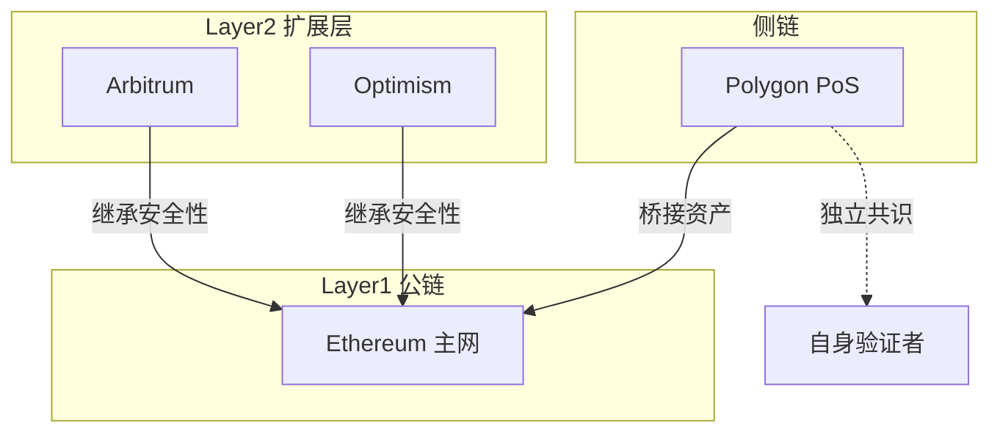

# Design: Part02 区块链与加密系统的最小认知

## Context

Part02 是 Web3 通识课的第二个核心模块，定位为帮助零基础学员建立对区块链技术的「最小必要认知」。

**目标学员画像**：
- 学生或 Web2 上班族
- 对 Web3 感兴趣但技术背景有限
- 希望理解原理而非成为技术专家

**内容定位**：
- 不需要理解密码学细节
- 不需要会写代码
- 需要理解「为什么区块链可信」「为什么需要不同的链」

## Goals / Non-Goals

### Goals
- 让学员理解区块链解决的核心信任问题
- 建立对比特币可信逻辑的基本认知
- 澄清「去中心化」的真实含义和边界
- 帮助学员区分公链、L2、侧链的实际差异
- 简要介绍模块化区块链趋势
- 建立「什么不适合上链」的判断框架

### Non-Goals
- 深入讲解密码学原理（哈希函数、椭圆曲线等）
- 教授智能合约开发
- 完整覆盖所有区块链项目
- 提供投资建议

## Content Structure Design

### 2.1 区块链解决的核心问题是什么

**核心问题**：双重支付问题（Double Spending Problem）

**内容框架**：
```
1. 数字世界的信任困境
   - 数字信息可以无限复制
   - 传统解决方案：中心化机构（银行、支付宝）

2. 拜占庭将军问题
   - 用生活类比解释分布式系统的信任难题

3. 区块链的解决方案
   - 时间戳 + 工作量证明 + 链式结构
   - 用「公开账本」比喻解释

4. 核心价值：去信任化（Trustless）
   - 不是「不需要信任」，而是「信任规则而非个人」
```

**类比**：
- 双重支付 → 同一张电影票卖给两个人
- 区块链 → 公开透明的记账本，人人可查

---

### 2.2 比特币的可信逻辑

**核心问题**：比特币如何在没有中心机构的情况下实现「价值转移」？

**内容框架**：
```
1. 比特币白皮书的核心思想（前 2-3 页精读）
   - 点对点电子现金系统
   - 解决了什么问题

2. 比特币的三个核心机制
   - 区块链结构：链式数据存储
   - 工作量证明（PoW）：如何达成共识
   - 激励机制：为什么矿工愿意参与

3. 「可信」的来源
   - 数学规则 > 人为承诺
   - 代码开源 > 黑箱运作
   - 分布式验证 > 单点审核

4. 比特币的局限性
   - 交易速度慢、能耗高
   - 功能简单（只能转账）
```

**必读资料**：
- 比特币白皮书前 2-3 页（中英文对照）

---

### 2.3 去中心化到底「去掉了什么」

**核心问题**：「去中心化」是口号还是有实际意义？

**内容框架**：
```
1. 「中心化」的具体含义
   - 权力中心：谁说了算
   - 数据中心：数据存在哪
   - 运维中心：谁在维护系统

2. 去中心化「去掉」的三件事
   - 单点故障风险
   - 审查和封禁的权力
   - 规则修改的任意性

3. 去中心化「没去掉」的东西
   - 仍然需要规则和共识
   - 仍然有治理和决策
   - 仍然可能出现权力集中（矿池、持币大户）

4. 去中心化的光谱
   - 不是「0 或 1」，而是程度差异
   - 不同项目的去中心化程度不同
```

**类比**：
- 中心化 → 一个老板说了算的公司
- 去中心化 → 股东投票决策的上市公司（但大股东仍有更大话语权）

---

### 2.4 公链、Layer2、侧链的本质区别

**核心问题**：为什么有这么多种「链」？普通用户需要关心什么？

**内容框架**：
```
1. 区块链的「不可能三角」
   - 去中心化、安全性、可扩展性
   - 为什么不能同时满足

2. 三种方案的对比

   | 类型 | 定义 | 安全性来源 | 典型例子 |
   |-----|------|-----------|---------|
   | 公链 (Layer1) | 底层主网 | 自身共识 | Ethereum, Solana |
   | Layer2 | 依附主链的扩展层 | 继承 L1 安全性 | Arbitrum, Optimism |
   | 侧链 | 独立运行的链 | 自身共识 | Polygon PoS |

3. 用户视角的实际差异
   - Gas 费：L2 通常更便宜
   - 确认时间：L2 更快
   - 资产桥接：跨链需要时间和风险

4. 如何选择
   - 大额资产 → 优先 L1
   - 高频交互 → 考虑 L2
   - 不同 DApp 可能在不同链上
```

**Mermaid 图表**：
- 公链 vs L2 vs 侧链的架构对比图
- 资产桥接流程图

---

### 2.5 模块化区块链与数据可用性（DA）

**核心问题**：区块链为什么要「模块化」？这对用户有什么影响？

**内容框架**：
```
1. 传统「单体区块链」的局限
   - 一条链做所有事情
   - 扩展性受限

2. 模块化区块链的四层分工
   - 执行层（Execution）：运行交易和智能合约
   - 结算层（Settlement）：最终确认和争议解决
   - 共识层（Consensus）：就交易顺序达成一致
   - 数据可用层（Data Availability）：存储交易数据

3. 数据可用性（DA）为什么重要
   - 保证任何人都能验证交易
   - Celestia、EigenDA 等方案简介

4. 对普通用户的影响
   - 更便宜的 Gas 费
   - 更快的交易速度
   - 更多的 L2 选择
```

**Mermaid 图表**：
- 单体 vs 模块化区块链架构对比

---

### 2.6 什么业务根本不适合上链

**核心问题**：区块链不是万能的，什么情况下不应该用区块链？

**内容框架**：
```
1. 区块链的核心特性复习
   - 透明、不可篡改、去信任
   - 代价：慢、贵、不可逆

2. 不适合上链的场景
   - 需要隐私保护的数据（病历、商业机密）
   - 需要频繁修改的数据（用户状态、实时数据）
   - 对延迟敏感的业务（高频交易、游戏帧同步）
   - 已有可信中心的场景（银行转账、政府系统）

3. 「伪区块链」项目的识别
   - 号称上链但本质是中心化数据库
   - 为了蹭热点而强行「区块链+」

4. 判断框架
   - 问题：这个业务真的需要「去信任」吗？
   - 问题：不用区块链会有什么无法接受的后果？
```

**案例**：
- 正面案例：跨境汇款、资产存证
- 反面案例：「区块链养鸡」「区块链溯源」的过度宣传

---

## Visual Design

### 推荐使用的可视化

| 章节 | 可视化类型 | 内容 |
|-----|----------|------|
| 2.1 | 流程图 | 双重支付问题的发生和解决 |
| 2.2 | 架构图 | 比特币网络的简化结构 |
| 2.3 | 对比表 | 中心化 vs 去中心化的特点 |
| 2.4 | 架构图 | L1/L2/侧链的关系 |
| 2.5 | 分层图 | 模块化区块链的四层架构 |
| 2.6 | 决策树 | 是否适合上链的判断流程 |

### Mermaid 图表示例

**2.4 公链/L2/侧链关系图**：


## Learning Task Design

每个章节的学习任务设计原则：
- 可验证（有明确输出物）
- 与核心知识点直接相关
- 难度适中（10-30 分钟可完成）

| 章节 | 学习任务 |
|-----|---------|
| 2.1 | 用 3 句话解释「为什么区块链能保证数据不可篡改」 |
| 2.2 | 阅读比特币白皮书前 2 页，用自己的话总结「比特币解决了什么问题」 |
| 2.3 | 列出 3 个「去中心化」去掉的东西和 2 个「没去掉」的东西 |
| 2.4 | 用一个生活比喻解释 Layer1 和 Layer2 的关系 |
| 2.5 | 画一张简图展示模块化区块链的四层分工 |
| 2.6 | 找一个「区块链+」的项目，分析它是否真的需要区块链 |

## Reference Sources Priority

### S 级（优先引用）
- 比特币白皮书原文
- Ethereum 官方文档
- Vitalik Buterin 的技术博客

### A 级（推荐引用）
- Binance Academy 系列教程
- a]6 Labs 研报
- Celestia 官方文档

### B 级（参考使用）
- Foresight News、律动等中文媒体
- 优质 KOL 的技术解读

## Risks / Trade-offs

| 风险 | 缓解措施 |
|-----|---------|
| 技术概念过于抽象 | 大量使用生活类比 |
| 内容可能过时 | 标注编写日期，定期更新 |
| 不同来源观点冲突 | 交叉验证，呈现主流共识 |
| 学员技术背景差异大 | 提供选读进阶资料 |

## Open Questions

- 是否需要为每个章节录制配套视频？
- 是否需要设计测验题目？
- 学习任务的提交和反馈机制如何设计？
