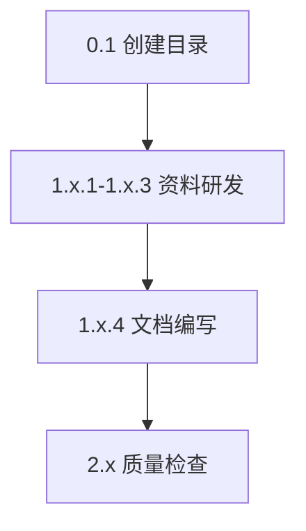

# Tasks: 完成 Part08 Web3 行业角色与岗位全景

## 0. 准备工作

- [x] 0.1 创建 Part08 目录结构
  - `Web3通识课课程内容/Part08-行业角色与岗位全景/`
  - `Part08-行业角色与岗位全景/assets/`
  - `Part08-行业角色与岗位全景/_research/`

## 1. 资料研发阶段

### 8.1 Web3 世界里都有哪些角色
- [x] 1.1.1 搜索 Web3 生态角色相关资料（中英文）
  - 关键词：Web3 ecosystem roles, crypto career landscape, blockchain industry participants
- [x] 1.1.2 整理各类角色的定义、职能、典型代表
- [x] 1.1.3 创建 `_research/8.1-研发笔记.md`
- [x] 1.1.4 编写 `8.1-Web3世界里都有哪些角色.md`

### 8.2 技术岗与非技术岗的真实差异
- [x] 1.2.1 搜索 Web3 岗位薪资、技能要求相关数据
  - 参考：LinkedIn、Web3.career、Crypto Jobs List、Electric Capital 报告
- [x] 1.2.2 整理技术岗 vs 非技术岗的对比维度
- [x] 1.2.3 创建 `_research/8.2-研发笔记.md`
- [x] 1.2.4 编写 `8.2-技术岗与非技术岗的真实差异.md`

### 8.3 学生 / Web2 上班族的常见切入点
- [x] 1.3.1 搜索 Web3 转型案例、切入建议
  - 关键词：Web2 to Web3 transition, 学生入行 Web3, 转型经验
- [x] 1.3.2 收集 3-5 个真实转型案例（成功与失败）
- [x] 1.3.3 创建 `_research/8.3-研发笔记.md`
- [x] 1.3.4 编写 `8.3-学生和Web2上班族的常见切入点.md`

### 8.4 哪些岗位被严重高估
- [x] 1.4.1 搜索 Web3 行业泡沫、岗位真相相关讨论
  - 参考：Twitter/X 讨论、行业媒体观点、从业者分享
- [x] 1.4.2 整理被高估岗位的特征和原因分析
- [x] 1.4.3 创建 `_research/8.4-研发笔记.md`
- [x] 1.4.4 编写 `8.4-哪些岗位被严重高估.md`

### 8.5 建立 Web3 个人品牌与影响力
- [x] 1.5.1 搜索 Web3 个人品牌建设、KOL 运营相关内容
  - 参考：成功 KOL 分享、社交媒体运营方法论
- [x] 1.5.2 整理 X / 小红书 / Paragraph 运营策略
- [x] 1.5.3 创建 `_research/8.5-研发笔记.md`
- [x] 1.5.4 编写 `8.5-建立Web3个人品牌与影响力.md`

## 2. 质量检查

- [x] 2.1 检查所有文档符合 `课程文档编写规范.md`
  - 包含：学习目标、核心内容、案例、概念速查、学习资料、学习任务、FAQ
- [x] 2.2 检查学习资料引用符合 `内容研发规范.md`
  - 必读 2-3 个，选读 2-5 个
  - 标注阅读时间
- [x] 2.3 检查数据标注（薪资、市场数据需标注来源和时间）
- [x] 2.4 检查 Mermaid 图表语法正确
- [x] 2.5 检查案例真实性（有据可查）
- [x] 2.6 检查章节之间内容衔接
- [x] 2.7 验证最终学习任务清晰可执行

## 3. 可并行的任务

以下任务可以并行执行：
- 1.1.1, 1.2.1, 1.3.1, 1.4.1, 1.5.1（资料搜索）
- 各章节的编写（在对应研发笔记完成后）

## 4. 依赖关系



各章节研发独立进行，最终统一质量检查：
```
0.1 → (1.1.1-1.1.3 → 1.1.4)
    → (1.2.1-1.2.3 → 1.2.4)
    → (1.3.1-1.3.3 → 1.3.4)
    → (1.4.1-1.4.3 → 1.4.4)
    → (1.5.1-1.5.3 → 1.5.4)
    → 2.1-2.7
```

## 5. 预期产出物

| 文件 | 类型 | 预期字数 | 实际状态 |
|-----|------|---------|---------|
| 8.1-Web3世界里都有哪些角色.md | 课程文档 | 3000-4000 | ✅ 完成 |
| 8.2-技术岗与非技术岗的真实差异.md | 课程文档 | 3500-4500 | ✅ 完成 |
| 8.3-学生和Web2上班族的常见切入点.md | 课程文档 | 3000-4000 | ✅ 完成 |
| 8.4-哪些岗位被严重高估.md | 课程文档 | 2500-3500 | ✅ 完成 |
| 8.5-建立Web3个人品牌与影响力.md | 课程文档 | 4000-5000 | ✅ 完成 |
| _research/8.x-研发笔记.md (x5) | 研发资料 | 各 1500-2500 | ✅ 完成 |

## 6. 关键数据来源建议

| 数据类型 | 推荐来源 |
|---------|---------|
| 薪资数据 | Web3.career, Crypto Jobs List, LinkedIn Salary Insights |
| 行业报告 | Electric Capital Developer Report, a16z Crypto State |
| 岗位信息 | Greenhouse, Lever (各大 Web3 公司招聘页) |
| 案例故事 | Twitter/X 分享, Medium, Mirror 文章 |
| KOL 运营 | 头部 KOL 公开分享, 运营社群讨论 |

## 完成状态

✅ 所有任务已完成 - 2025-01-09
