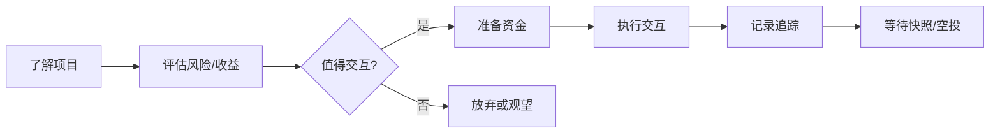
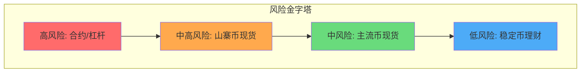

# Design: Part09 参与 Web3 的四种方式内容设计

## Context

Part09「参与 Web3 的四种方式」是课程的行动指南章节。在学员完成前 8 个 Part 的学习后，已经具备了：
- Web3 基础认知（Part1-2）
- 钱包操作能力（Part3）
- Token 和赛道知识（Part4-5）
- 风险识别能力（Part6-7）
- 行业角色认知（Part8）

本章节的目标是帮助学员根据自身情况，选择合适的参与方式，做出理性决策。

## Goals / Non-Goals

### Goals
- 提供清晰的参与方式分类框架（学习/小额/投资/职业）
- 帮助学员评估自身适合哪种参与方式
- 为每种参与方式提供具体的行动指南和风险提示
- 让学员建立合理的预期，避免冲动决策

### Non-Goals
- 不推荐具体的投资标的或项目
- 不承诺任何收益或回报
- 不鼓励激进的参与方式
- 不提供投资建议（仅提供教育信息）

## Content Design

### 核心设计理念

**参与方式光谱**：
```
投入程度 →
低 ←─────────────────────────────→ 高

只学习 → 小额参与 → 投资参与 → 职业化参与

风险程度 →
低 ←─────────────────────────────→ 高
```

**每种方式都是有效的参与**：
- 强调「只学习」也是一种有效的参与方式
- 不同阶段可以选择不同的参与方式
- 没有「正确答案」，只有「适合自己的选择」

### 9.1 只学习、不入局的参与方式

**核心叙事线**：
```
学习本身就是一种投资
认知积累 → 机会储备 → 时机把握
```

**知识点设计**：

1. **为什么「只学习」是有效的参与**
   - Web3 学习的长期价值
   - 认知复利效应
   - 避免「交学费」的智慧

2. **学习型参与的具体方式**
   - 信息跟踪：Twitter/X、播客、Newsletter
   - 系统学习：课程、书籍、白皮书
   - 社区参与：Discord、Telegram（旁观者角色）
   - 内容输出：学习笔记、思考分享

3. **学习路径规划**
   - 从宏观到微观：先建立全局观，再深入具体领域
   - 理论 + 实践：即使不投入资金，也可以用测试网练手
   - 时间分配建议：每周投入 X 小时的参考

4. **何时从学习转向其他参与方式**
   - 判断标准：知识储备、风险承受能力、时间精力
   - 转换时机的信号

**可视化**：
- 学习路径思维导图
- 学习资源分类表

**案例**：
- 某 Web2 开发者通过 1 年学习积累，在适当时机成功转型

### 9.2 小额参与的正确姿势

**核心叙事线**：
```
小额试错 ≠ 零风险
学习成本 + 机会收益 = 理性的小额参与
```

**知识点设计**：

1. **空投与撸毛生态简介**
   - 什么是空投（Airdrop）
   - 空投的商业逻辑：项目方的用户获取策略
   - 撸毛（Farming）的定义和演变
   - 空投类型：追溯性空投 vs 预期空投

2. **空投的运作逻辑**
   - 项目方视角：为什么要做空投
   - 用户视角：空投的价值来源
   - 空投标准的常见维度：交互次数、资金量、时间跨度、链上身份

3. **小额交互的实操指南**
   - 选择交互项目的判断标准
   - 交互的基本流程
   - 成本控制：Gas 费、本金、时间成本
   - 记录和追踪：如何管理多个交互

4. **小额交互的风险控制**
   - 合约授权风险
   - 钓鱼和诈骗风险
   - 时间成本 vs 实际收益
   - 预期管理：大多数空投的真实价值

5. **成本收益分析**
   - 时间成本计算
   - 资金成本（Gas + 本金）计算
   - 机会成本考量
   - 合理预期的建立

**可视化**：


**案例**：
- Uniswap 空投：早期用户获得 400 UNI
- Arbitrum 空投：交互标准和结果分析
- 失败案例：某项目空投后价值归零

### 9.3 投资参与：从持币到交易

**核心叙事线**：
```
投资 ≠ 赌博
风险管理 > 收益追求
纪律 > 情绪
```

**知识点设计**：

1. **现货持有 vs 合约交易的本质区别**

   | 维度 | 现货 | 合约 |
   |-----|-----|------|
   | 风险等级 | 中等 | 极高 |
   | 最大亏损 | 本金 | 可超过本金 |
   | 收益模式 | 价格上涨 | 双向交易 |
   | 适合人群 | 大多数人 | 专业交易者 |
   | 心理压力 | 较低 | 极高 |

   **风险警示**：合约交易的高风险性

2. **CEX vs DEX 的选择**

   | 维度 | CEX | DEX |
   |-----|-----|------|
   | 资产托管 | 平台托管 | 自托管 |
   | KYC 要求 | 必须 | 通常不需要 |
   | 交易体验 | 流畅 | 较复杂 |
   | 币种丰富度 | 主流币为主 | 长尾币更多 |
   | 风险类型 | 平台风险 | 合约风险 |

   **案例**：FTX 暴雷事件的教训

3. **仓位管理与投资心态**
   - 永远不要全仓
   - 只投入可以承受归零的资金
   - 分散投资 vs 集中投资
   - 止损和止盈的设置
   - 情绪管理：恐惧与贪婪

4. **定投、波段、长持的适用场景**

   | 策略 | 适用场景 | 优势 | 劣势 |
   |-----|---------|-----|------|
   | 定投 | 长期看好、不想择时 | 平滑成本 | 牛市收益有限 |
   | 波段 | 有一定技术分析能力 | 潜在更高收益 | 需要时间精力、易出错 |
   | 长持 | 坚定看好某个项目 | 简单省心 | 可能错过卖点 |

5. **常见投资陷阱**
   - **FOMO**：错过恐惧导致追高
   - **追涨杀跌**：情绪化交易
   - **杠杆爆仓**：过度使用杠杆
   - **信息不对称**：被 KOL 带节奏
   - **沉没成本谬误**：舍不得止损

**可视化**：


**风险提示声明**（必须包含）：
> ⚠️ **风险提示**：加密货币投资具有高度风险，价格波动剧烈，可能导致本金全部损失。本课程内容仅供教育目的，不构成投资建议。投资前请充分了解风险，只投入您能够承受损失的资金。

### 9.4 职业化参与的现实门槛

**核心叙事线**：
```
职业化 ≠ 最佳选择
门槛真实存在，但可以跨越
```

**知识点设计**：

1. **职业化参与的主要路径**
   - 技术岗：智能合约开发、前端/后端开发、安全审计
   - 非技术岗：运营、市场、社区、研究、BD
   - 创业：项目创始人、独立开发者
   - 投资：基金分析师、交易员

2. **各路径的真实门槛**

   | 路径 | 技能要求 | 时间门槛 | 机会稀缺度 |
   |-----|---------|---------|-----------|
   | 智能合约开发 | Solidity/Rust + 安全意识 | 6-12 个月 | 高 |
   | 前端开发 | Web3.js/ethers.js + React | 3-6 个月 | 中 |
   | 社区运营 | 沟通 + 英语 + 行业理解 | 1-3 个月 | 低 |
   | 研究分析 | 研究方法 + 写作 + 数据分析 | 3-6 个月 | 中 |

3. **从业者真实经验**
   - 行业薪资水平（参考数据）
   - 工作节奏和压力
   - 职业发展路径
   - 行业不稳定性

4. **进入行业的实际建议**
   - 建立作品集/Portfolio
   - 参与开源项目
   - 建立行业人脉
   - 从兼职/实习开始
   - 持续学习和输出

5. **职业化参与的隐性成本**
   - 时间机会成本
   - 放弃稳定性
   - 行业周期风险
   - 认知更新压力

**可视化**：
- Web3 职业路径图
- 各岗位技能要求雷达图

**案例**：
- 成功案例：Web2 转 Web3 的开发者路径
- 现实案例：行业寒冬中的裁员故事

## Cross-References

- 9.1 承接 Part1 的认知建立，为持续学习提供方法论
- 9.2 需要 Part3 钱包操作基础，引用 Part6 风险知识
- 9.3 需要 Part4 Token 知识基础，重点引用 Part6 风险内容
- 9.4 承接 Part8 行业角色，为进一步行动提供指导
- 整体承接全部 Part1-8，为 Part10 决策建议做铺垫

## Learning Resources Strategy

每章节学习资料选择原则：
- **必读**：1-2 篇，优先实操指南或权威分析
- **选读**：2-3 篇，进阶内容或视频

重点资料库：
- 空投/撸毛：各大空投教程、DefiLlama 等
- 投资：CoinGecko 学习中心、Binance Academy
- 职业：Web3 求职平台、从业者分享

## Risks / Trade-offs

### 内容风险
- **投资相关内容的合规风险**
  - 缓解：明确声明不构成投资建议，添加风险提示

- **空投撸毛内容可能被误解为「教人薅羊毛」**
  - 缓解：强调风险和成本，不推荐具体项目

- **职业化建议可能过于乐观或悲观**
  - 缓解：提供真实数据和多元视角

### 内容平衡
- 需要在「鼓励参与」和「风险警示」之间找到平衡
- 原则：不劝退也不煽动，提供客观信息让学员自己决策

## Open Questions

- [ ] 9.2 空投部分是否需要提供具体的交互案例演示？（风险：案例可能过时或被误导）
- [ ] 9.3 投资部分是否需要介绍技术分析基础？（风险：可能超出通识课范畴）
- [ ] 9.4 职业部分是否需要提供薪资数据？（风险：数据时效性和地区差异）
